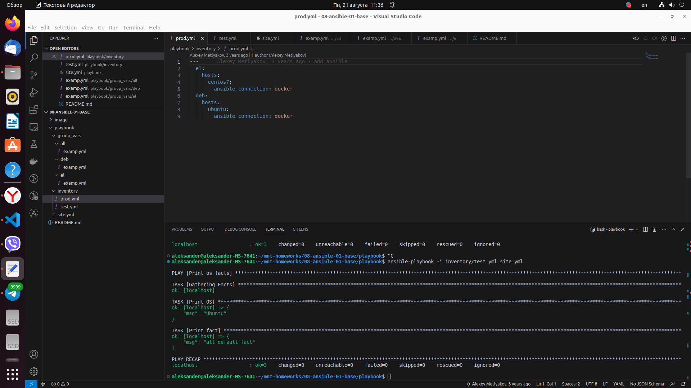
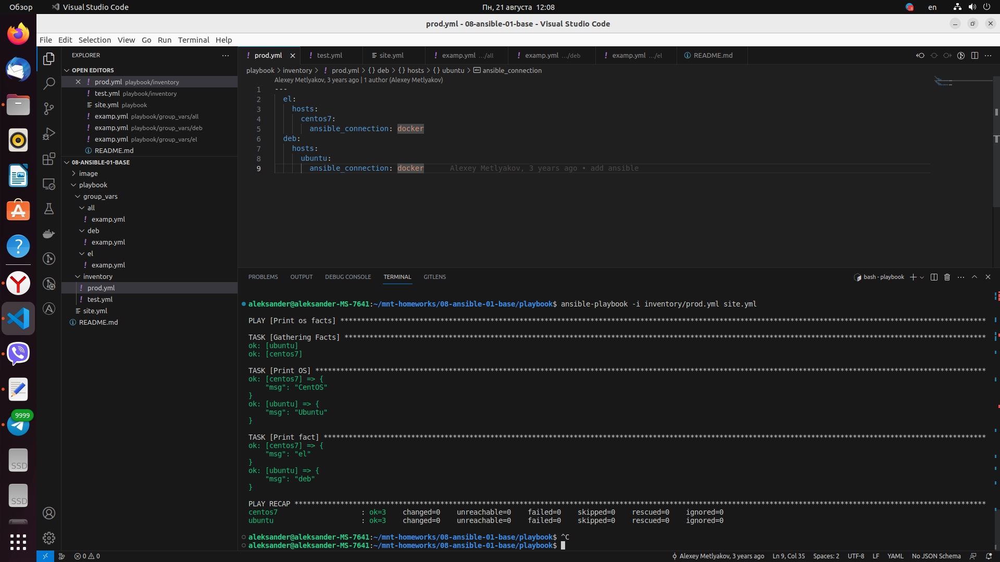
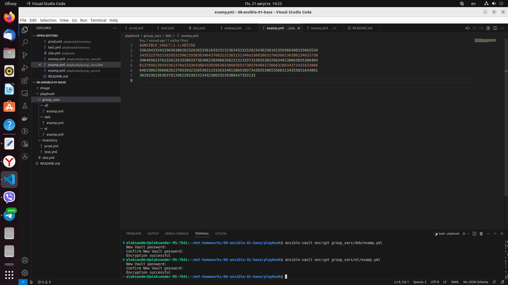
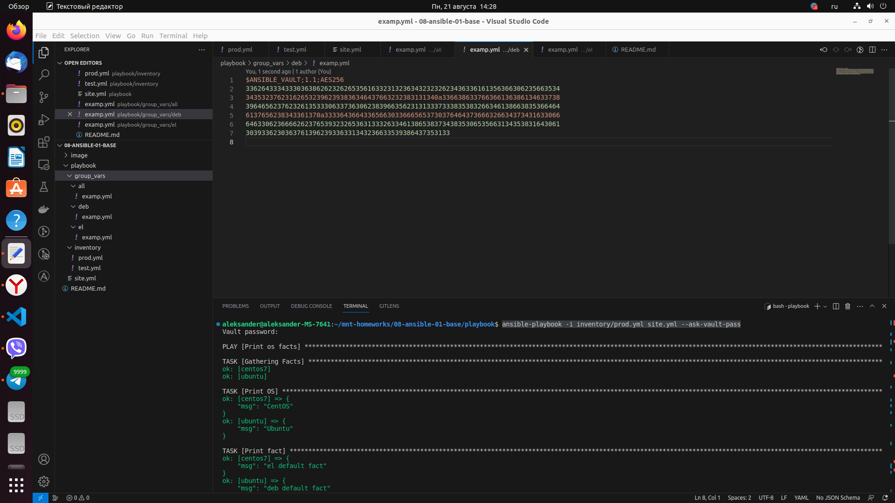
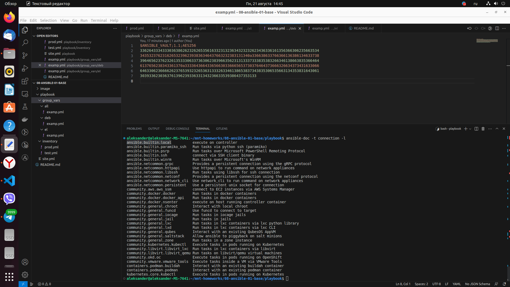
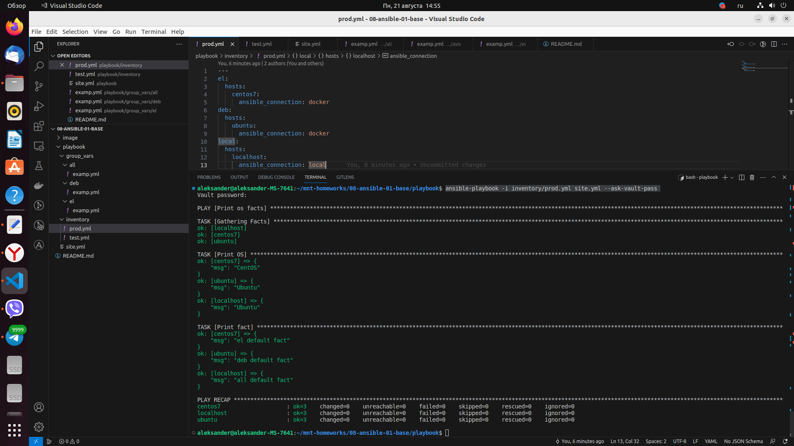

# Домашнее задание к занятию 1 «Введение в Ansible»

## Подготовка к выполнению

1. Установите Ansible версии 2.10 или выше.
2. Создайте свой публичный репозиторий на GitHub с произвольным именем.
3. Скачайте [Playbook](./playbook/) из репозитория с домашним заданием и перенесите его в свой репозиторий.

## Основная часть

1. Попробуйте запустить playbook на окружении из `test.yml`, зафиксируйте значение, которое имеет факт `some_fact` для указанного хоста при выполнении playbook.
2. Найдите файл с переменными (group_vars), в котором задаётся найденное в первом пункте значение, и поменяйте его на `all default fact`.
3. Воспользуйтесь подготовленным (используется `docker`) или создайте собственное окружение для проведения дальнейших испытаний.
4. Проведите запуск playbook на окружении из `prod.yml`. Зафиксируйте полученные значения `some_fact` для каждого из `managed host`.
5. Добавьте факты в `group_vars` каждой из групп хостов так, чтобы для `some_fact` получились значения: для `deb` — `deb default fact`, для `el` — `el default fact`.
6. Повторите запуск playbook на окружении `prod.yml`. Убедитесь, что выдаются корректные значения для всех хостов.
7. При помощи `ansible-vault` зашифруйте факты в `group_vars/deb` и `group_vars/el` с паролем `netology`.
8. Запустите playbook на окружении `prod.yml`. При запуске `ansible` должен запросить у вас пароль. Убедитесь в работоспособности.
9. Посмотрите при помощи `ansible-doc` список плагинов для подключения. Выберите подходящий для работы на `control node`.
10. В `prod.yml` добавьте новую группу хостов с именем  `local`, в ней разместите localhost с необходимым типом подключения.
11. Запустите playbook на окружении `prod.yml`. При запуске `ansible` должен запросить у вас пароль. Убедитесь, что факты `some_fact` для каждого из хостов определены из верных `group_vars`.
12. Заполните `README.md` ответами на вопросы. Сделайте `git push` в ветку `master`. В ответе отправьте ссылку на ваш открытый репозиторий с изменённым `playbook` и заполненным `README.md`.


## Необязательная часть

1. При помощи `ansible-vault` расшифруйте все зашифрованные файлы с переменными.
2. Зашифруйте отдельное значение `PaSSw0rd` для переменной `some_fact` паролем `netology`. Добавьте полученное значение в `group_vars/all/exmp.yml`.
3. Запустите `playbook`, убедитесь, что для нужных хостов применился новый `fact`.
4. Добавьте новую группу хостов `fedora`, самостоятельно придумайте для неё переменную. В качестве образа можно использовать [этот вариант](https://hub.docker.com/r/pycontribs/fedora).
5. Напишите скрипт на bash: автоматизируйте поднятие необходимых контейнеров, запуск ansible-playbook и остановку контейнеров.
6. Все изменения должны быть зафиксированы и отправлены в ваш личный репозиторий.

---

## Решение

1. Запускаем playbook на окружении из `test.yml` командой ***ansible-playbook -i inventory/test.yml site.yml***, фиксируем значение факта `some_fact` для указанного хоста при выполнении playbook - 12 (***"msg": 12**)
<p align="center">
  
</p>

2. Меняем значение `some_fact` в файле с переменными (group_vars) на `all default fact`, проверяем внесенные изменения:
<p align="center">
  
</p>

3. Для проведения дальнейших испытаний создаем окружение `docker`, выполняем команды:
   ***docker run --name centos7 -d pycontribs/centos:7***
   ***docker run --name ubuntu -d pycontribs/ubuntu***

4. Запускаем playbook на окружении из `prod.yml` командой ***ansible-playbook -i inventory/prod.yml site.yml***, фиксируем значение факта `some_fact` для каждого из `managed host` при выполнении playbook:
```
TASK [Print fact] ********************************************************************************
ok: [centos7] => {
    "msg": "el"
}
ok: [ubuntu] => {
    "msg": "deb"
}
```
<p align="center">
  
</p>

5. Добавляем факты в `group_vars` каждой из групп хостов: для `deb` — `deb default fact`, для `el` — `el default fact`. 
 - el.yml:
 ```
 ---
some_fact: "el default fact"
 ```
 - deb.yml: 
  ```
---
some_fact: "deb default fact"
 ``` 

6. Запускаем playbook на окружении `prod.yml`, фиксируем результат:
<p align="center">
  
</p>

7. При помощи `ansible-vault` шифруем факты в `group_vars/deb` и `group_vars/el` с паролем `netology`:
<p align="center">
  
</p>

8. Запускаем playbook при помощи команды ***ansible-playbook -i inventory/prod.yml site.yml --ask-vault-pass*** и вводим пароль `netology`, получаем результат:
<p align="center">
  
</p>

9. Запускаем команду ***ansible-doc -t connection -l***, получаем список плагинов для подключения, подходящий для работы на `control node` - ansible.builtin.local
<p align="center">
  
</p>

10. В файле `prod.yml` добавляем новую группу хостов с именем  `local`, в ней размещаем localhost с типом подключения local:
```
local:
  hosts:
    localhost:
      ansible_connection: local
```

11. Запускаем playbook на окружении `prod.yml` с помощью команды ansible-playbook -i inventory/prod.yml site.yml --ask-vault-pass, фиксируем результат:
<p align="center">
  
</p>


### Как оформить решение задания

Выполненное домашнее задание пришлите в виде ссылки на .md-файл в вашем репозитории.

---
