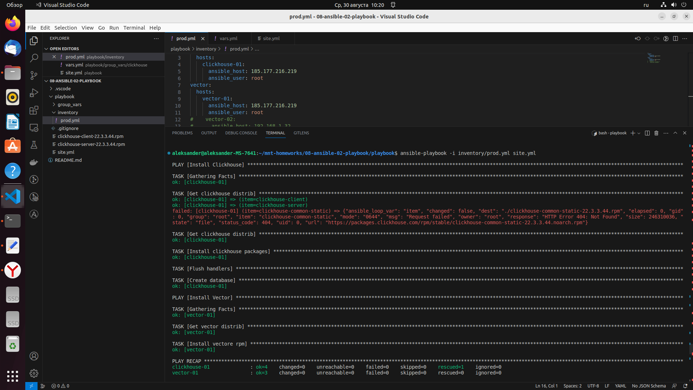
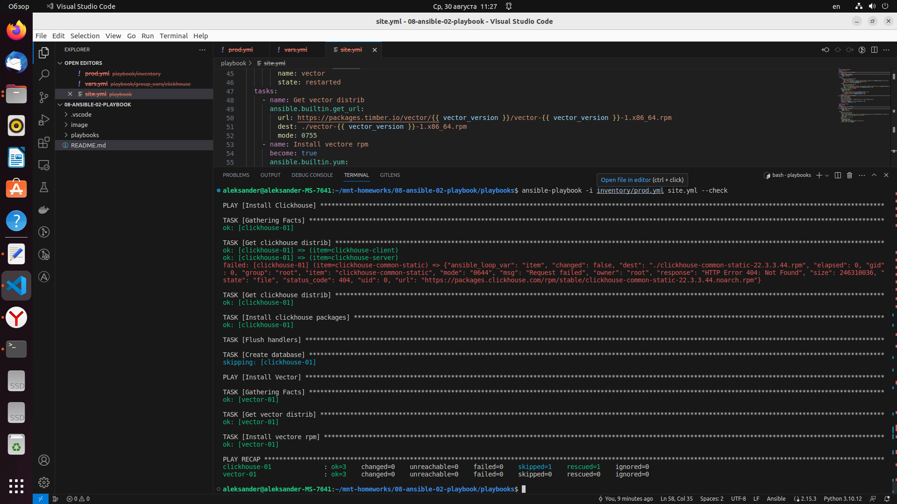
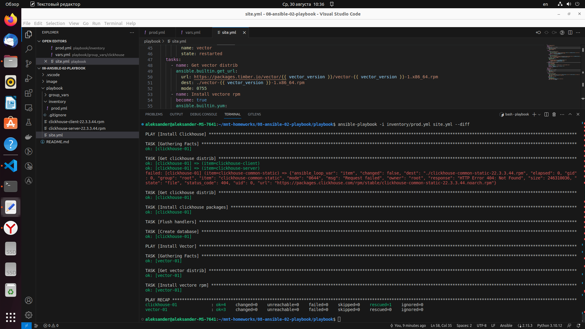
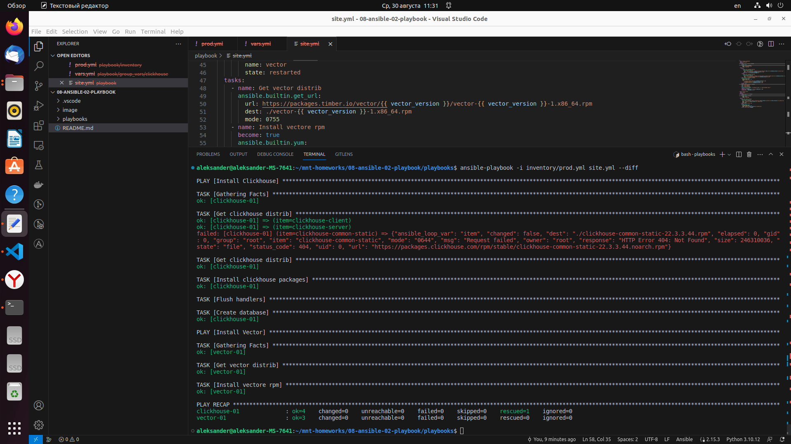

# Домашнее задание к занятию 2 «Работа с Playbook»

## Подготовка к выполнению

1. * Необязательно. Изучите, что такое [ClickHouse](https://www.youtube.com/watch?v=fjTNS2zkeBs) и [Vector](https://www.youtube.com/watch?v=CgEhyffisLY).
2. Создайте свой публичный репозиторий на GitHub с произвольным именем или используйте старый.
3. Скачайте [Playbook](./playbook/) из репозитория с домашним заданием и перенесите его в свой репозиторий.
4. Подготовьте хосты в соответствии с группами из предподготовленного playbook.

## Основная часть

1. Подготовьте свой inventory-файл `prod.yml`.
2. Допишите playbook: нужно сделать ещё один play, который устанавливает и настраивает [vector](https://vector.dev). Конфигурация vector должна деплоиться через template файл jinja2.
3. При создании tasks рекомендую использовать модули: `get_url`, `template`, `unarchive`, `file`.
4. Tasks должны: скачать дистрибутив нужной версии, выполнить распаковку в выбранную директорию, установить vector.
5. Запустите `ansible-lint site.yml` и исправьте ошибки, если они есть.
6. Попробуйте запустить playbook на этом окружении с флагом `--check`.
7. Запустите playbook на `prod.yml` окружении с флагом `--diff`. Убедитесь, что изменения на системе произведены.
8. Повторно запустите playbook с флагом `--diff` и убедитесь, что playbook идемпотентен.
9. Подготовьте README.md-файл по своему playbook. В нём должно быть описано: что делает playbook, какие у него есть параметры и теги. Пример качественной документации ansible playbook по [ссылке](https://github.com/opensearch-project/ansible-playbook).
10. Готовый playbook выложите в свой репозиторий, поставьте тег `08-ansible-02-playbook` на фиксирующий коммит, в ответ предоставьте ссылку на него.

## Решение

1. Выполняем подготовку inventory-файл `prod.yml`, дописываем следующий код:
```
---
clickhouse:
  hosts:
    clickhouse-01:
      ansible_host: 192.168.1.31
      ansible_user: ansible
vector:
  hosts:
    vector-01:
      ansible_host: 192.168.1.31
    vector-02:
      ansible_host: 192.168.1.32
      ansible_user: aleksander
```
2. Дописываем playbook, устанавливаем и настраиваем ***vector***
```
- name: Install Vector
  hosts: vector
  handlers:
    - name: Start vector service
      become: true
      ansible.builtin.service:
        name: vector
        state: restarted
  tasks:
    - name: Get vector distrib
      ansible.builtin.get_url:
        url: https://packages.timber.io/vector/{{ vector_version }}/vector-{{ vector_version }}-1.x86_64.rpm
        dest: ./vector-{{ vector_version }}-1.x86_64.rpm
        mode: 0755
    - name: Install vectore rpm
      become: true
      ansible.builtin.yum:
        disable_gpg_check: true
        name: vector-{{ vector_version }}-1.x86_64.rpm
      notify: Start vector service
```
Проверяем корректную работу ansible-playbook -i inventory/prod.yml site.yml 
<p align="center">
  
</p>


5. Запускаем `ansible-lint site.yml`, результат выполнения команды:
```
aleksander@aleksander-MS-7641:~/mnt-homeworks/08-ansible-02-playbook/playbook$ ansible-lint site.yml
WARNING: PATH altered to include /usr/bin
WARNING  Overriding detected file kind 'yaml' with 'playbook' for given positional argument: site.yml
an AnsibleCollectionFinder has not been installed in this process
```
Исправляем 'playbook' на 'playbooks'
Выполняем экспорт ***$ export PATH=/usr/bin***

Запускаем `ansible-lint site.yml`, результат выполнения команды:
```
aleksander@aleksander-MS-7641:~/mnt-homeworks/08-ansible-02-playbook/playbook$ ansible-lint site.yml
an AnsibleCollectionFinder has not been installed in this process
```
 
```
aleksander@aleksander-MS-7641:~/mnt-homeworks/08-ansible-02-playbook/playbook$ ansible-lint site.yml
WARNING: PATH altered to include /usr/bin
WARNING  Overriding detected file kind 'yaml' with 'playbook' for given positional argument: site.yml
an AnsibleCollectionFinder has not been installed in this process
```

6. Запусаем playbook на этом окружении с флагом `--check`
<p align="center">
  
</p>

7. Запускаем playbook на `prod.yml` окружении с флагом `--diff`, изменения произведены:
<p align="center">
  
</p>

8. Повторно запускаем playbook с флагом `--diff` и убеждаемся, что playbook идемпотентен:
<p align="center">
  
</p> 
 
---

### Как оформить решение задания

Выполненное домашнее задание пришлите в виде ссылки на .md-файл в вашем репозитории.

---
