# Домашнее задание к занятию 3 «Использование Ansible»

## Подготовка к выполнению

1. Подготовьте в Yandex Cloud три хоста: для `clickhouse`, для `vector` и для `lighthouse`.
2. Репозиторий LightHouse находится [по ссылке](https://github.com/VKCOM/lighthouse).

## Основная часть

1. Допишите playbook: нужно сделать ещё один play, который устанавливает и настраивает LightHouse.
2. При создании tasks рекомендую использовать модули: `get_url`, `template`, `yum`, `apt`.
3. Tasks должны: скачать статику LightHouse, установить Nginx или любой другой веб-сервер, настроить его конфиг для открытия LightHouse, запустить веб-сервер.
4. Подготовьте свой inventory-файл `prod.yml`.
5. Запустите `ansible-lint site.yml` и исправьте ошибки, если они есть.
6. Попробуйте запустить playbook на этом окружении с флагом `--check`.
7. Запустите playbook на `prod.yml` окружении с флагом `--diff`. Убедитесь, что изменения на системе произведены.
8. Повторно запустите playbook с флагом `--diff` и убедитесь, что playbook идемпотентен.
9. Подготовьте README.md-файл по своему playbook. В нём должно быть описано: что делает playbook, какие у него есть параметры и теги.
10. Готовый playbook выложите в свой репозиторий, поставьте тег `08-ansible-03-yandex` на фиксирующий коммит, в ответ предоставьте ссылку на него.


1. Дописываем playbook из предыдущего задания (задание к лекции №2 - Работа с Playbook),  делаем ещё один play, для устанавки и настройки LightHouse с учетом того что будет еще play Nginx: 
```
- name: Install Lighthouse
  hosts: lighthouse
  handlers:
    - name: reload-nginx
      become: true
      command: nginx -s reload
  pre_tasks:
    - name: Lighthouse | Install Git
      become: true
      ansible.builtin.yum:
        name: git
        state: present
  tasks:
    - name: Lighthouse | Copy from github
      become: true
      git:
        repo: "{{ lighthouse_vcs }}"
        version: master
        dest: "{{ lighthouse_location_dir }}"
    - name: Lighthouse | Create lighthouse vector_config
      become: true
      template:
        src: templates/lighthouse.conf.j2
        dest: /etc/nginx/conf.d/default.conf
        mode: 0644
      notify: reload-nginx
```

3. Дописываем playbook, включаем play Nginx:
```
- name: Install Nginx
  hosts: lighthouse
  handlers:
    - name: start-nginx
      become: true
      command: nginx
    - name: reload-nginx
      become: true
      command: nginx -s reload
  tasks:
    - name: NGINX | Install epel-release
      become: true
      ansible.builtin.yum:
        name: epel-release
        state: present
    - name: NGINX | Install NGINX
      become: true
      ansible.builtin.yum:
        name: nginx
        state: present
    - name: NGINX | Create Config
      become: true
      template:
        src: templates/nginx.conf.j2
        dest: /etc/nginx/nginx.conf
        mode: 0644
      notify: start-nginx
```
 - Редактируем play `vector` с учетом его настройки
```
- name: Install Vector
  hosts: vector
  tasks:
    - name: Install Vector
      become: true
      ansible.builtin.yum:
        name: "{{ vector_url }}"
        state: present
    - name: Vector | Template Config
      ansible.builtin.template:
        src: templates/vector.yml.j2
        dest: vector.yml
        mode: "0644"
        owner: "{{ ansible_user_id }}"
        group: "{{ ansible_user_gid }}"
        validate: vector validate --no-environment --config-yaml %s
    - name: Vector | Create systemd unit
      become: true
      ansible.builtin.template:
        src: templates/vector.service.j2
        dest: /etc/systemd/vector.service
        mode: "0755"
        owner: "{{ ansible_user_id }}"
        group: "{{ ansible_user_gid }}"
    - name: Vector | Start Service
      become: true
      ansible.builtin.systemd:
        name: vector
        state: started
        daemon_reload: true
```

4. Создаем в Yandex Cloud три хоста: для `clickhouse`, для `vector` и для `lighthouse` и редактируем inventory-файл `prod.yml`
<p align="center">
  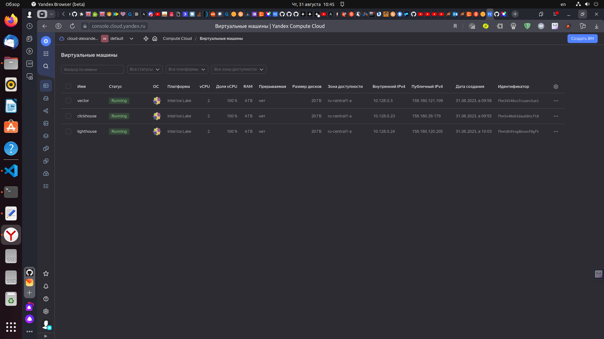
</p>

```
---
clickhouse:
  hosts:
    clickhouse-01:
      ansible_host: 158.160.39.179
      ansible_user: aleksander
vector:
  hosts:
    vector-01:
      ansible_host: 158.160.121.109
      ansible_user: aleksander
lighthouse:
  hosts:
    lighthouse-01:
      ansible_host: 158.160.120.205
      ansible_user: aleksander
```

Запускаем playbook, проверяем корректную работу:
 - начало выполнения
<p align="center">
  
</p>
 - окончание выполнения
<p align="center">
  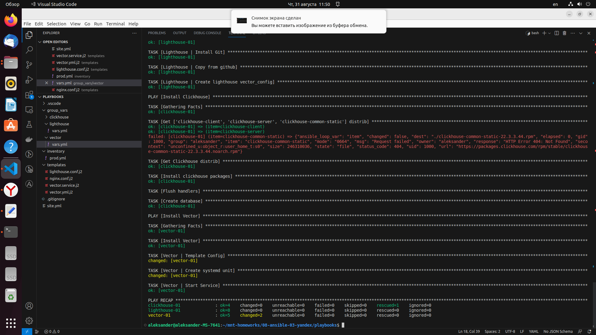
</p>

 - проверяем установку `clickhouse` на хосте
<p align="center">
  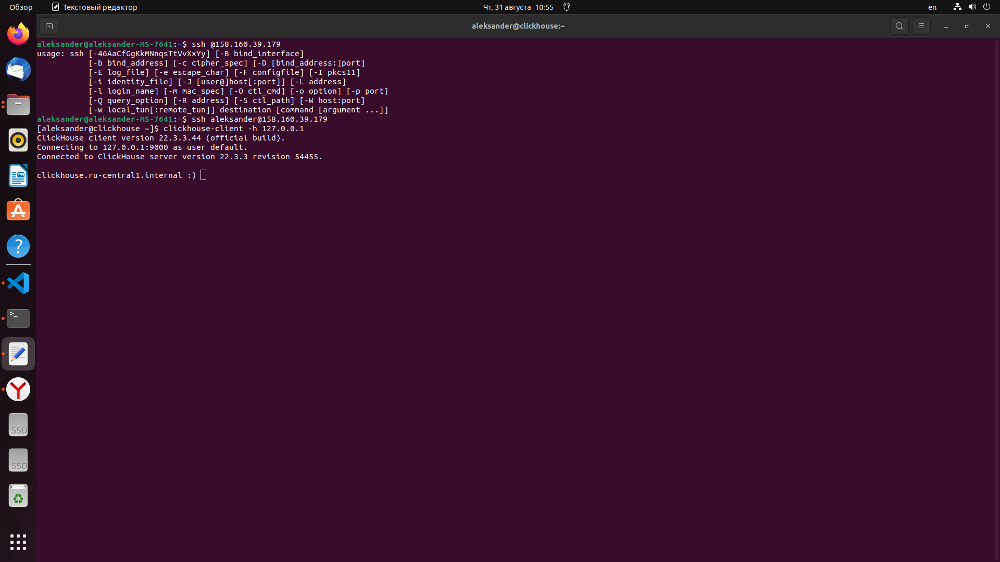
</p> 

 - проверяем установку `vector` на хосте
<p align="center">
  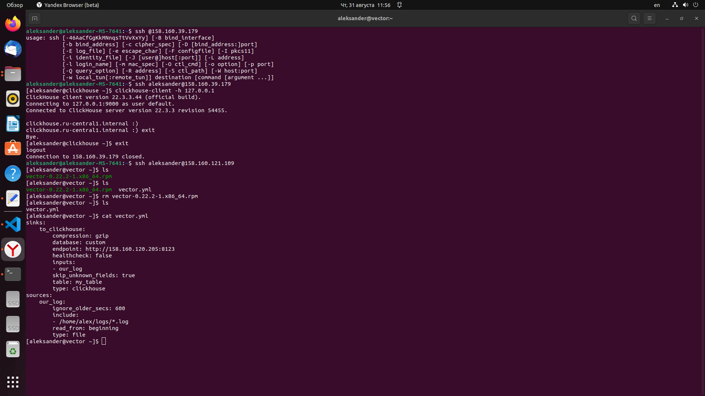
</p>  

 - проверяем установку `lighthouse` на хосте
<p align="center">
  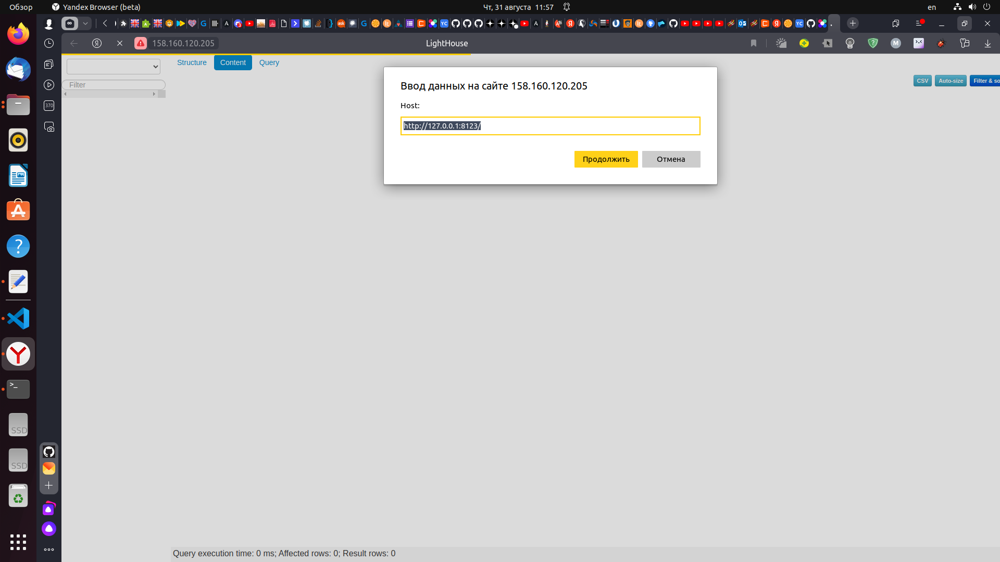
</p>  


5. Запускаем `ansible-lint site.yml` и исправляем ошибки, выполняем экспорт ***$ export PATH=/usr/bin***:
<p align="center">
  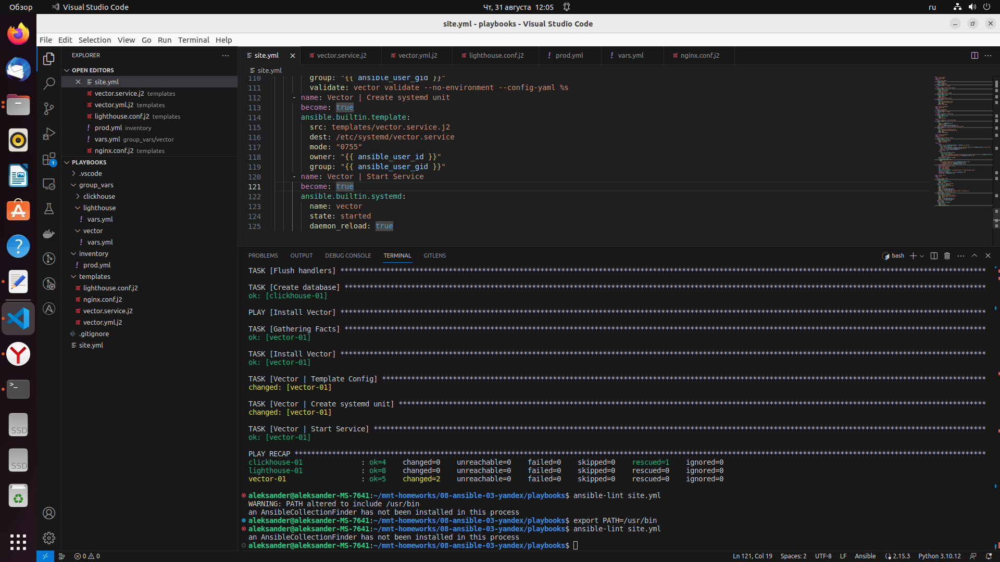
</p> 

6. Запускаем playbook на окружении `prod.yml` с флагом `--check` ***ansible-playbook -i inventory/prod.yml site.yml --check***:

 - начало выполнения
<p align="center">
  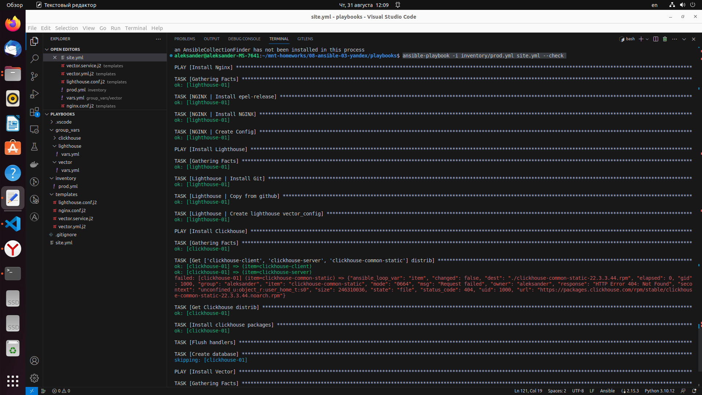
</p>

 - окончание выполнения
<p align="center">
  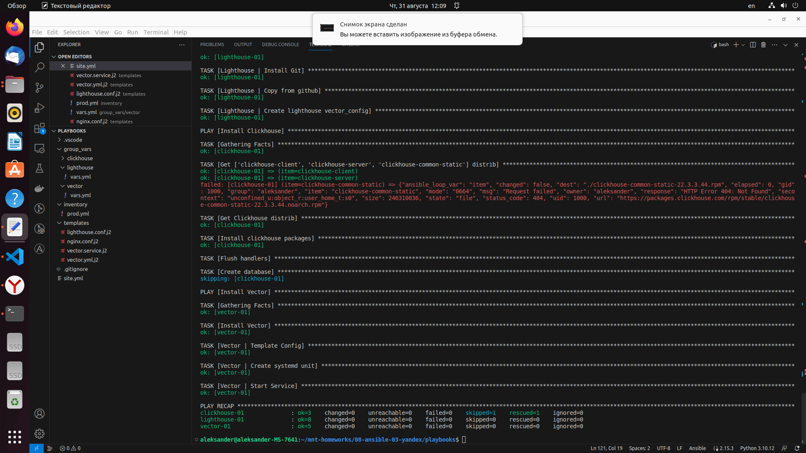
</p>


7. Запускаем playbook на окружении `prod.yml` с флагом `--diff` ***ansible-playbook -i inventory/prod.yml site.yml --diff***:

 - начало выполнения
<p align="center">
  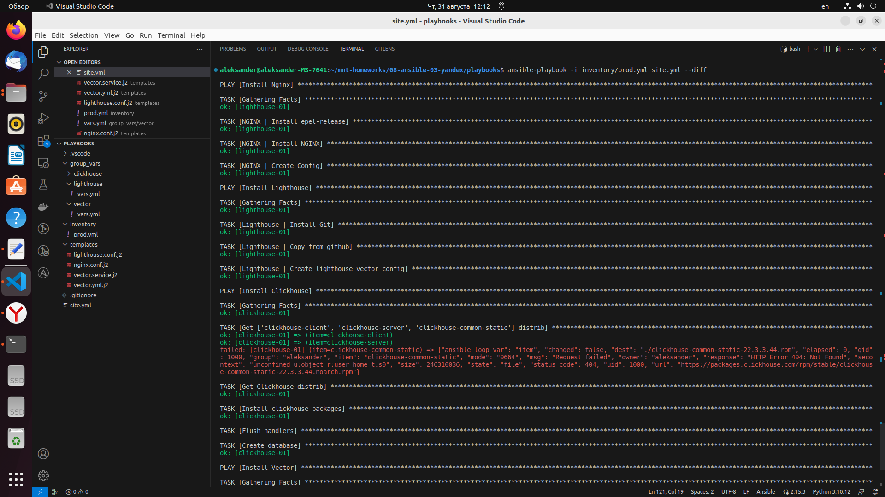
</p>

 - окончание выполнения
<p align="center">
  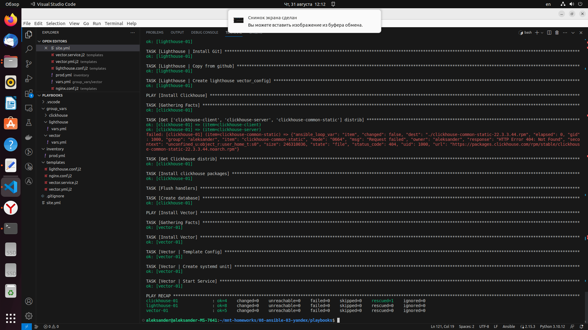
</p>

8. Повторно запускаем playbook с флагом `--diff` и убеждаемся, что playbook идемпотентен:

 - начало выполнения
<p align="center">
  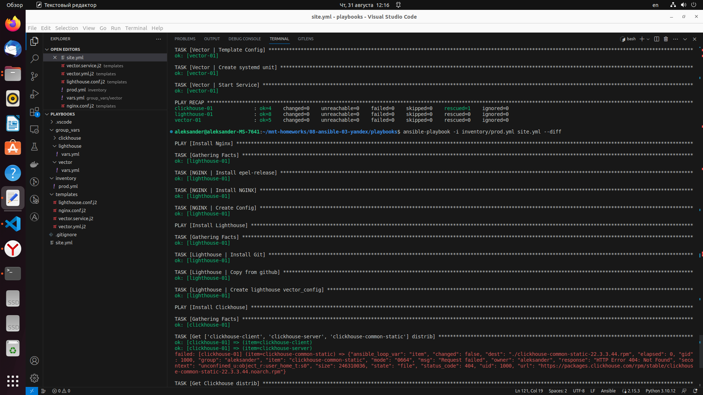
</p>

 - окончание выполнения
<p align="center">
  
</p>
 
---

### Как оформить решение задания

Выполненное домашнее задание пришлите в виде ссылки на .md-файл в вашем репозитории.

---
