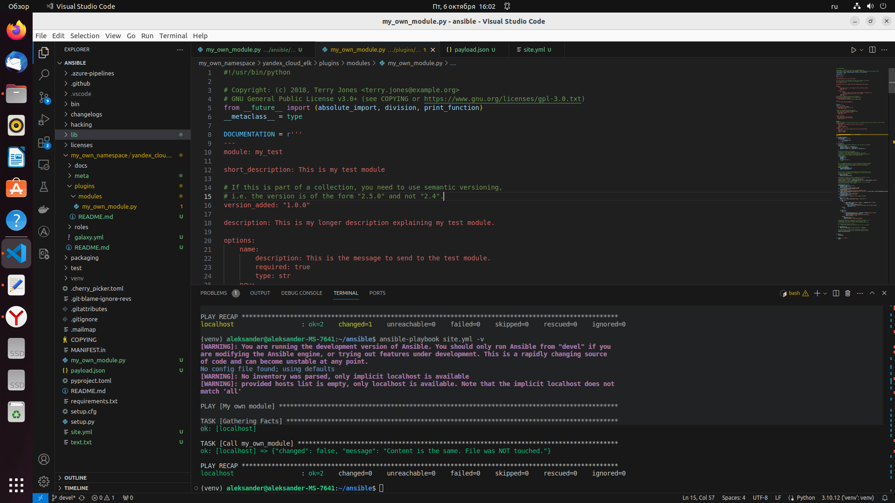
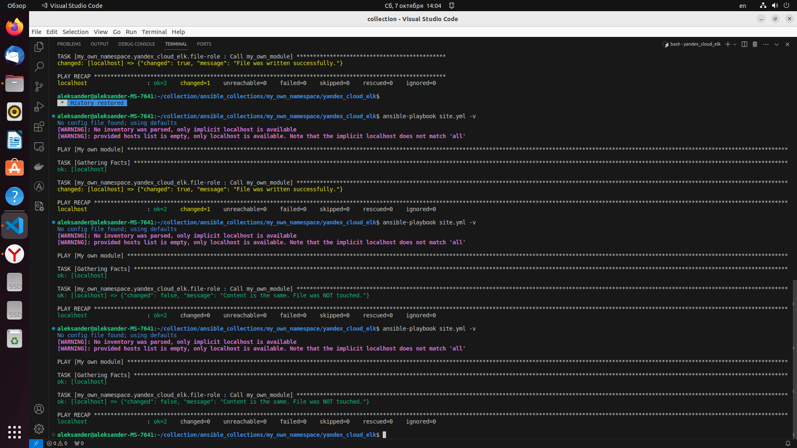

# Домашнее задание к занятию 6 «Создание собственных модулей»

## Подготовка к выполнению

1. Создайте пустой публичный репозиторий в своём любом проекте: `my_own_collection`.
2. Скачайте репозиторий Ansible: `git clone https://github.com/ansible/ansible.git` по любому, удобному вам пути.
3. Зайдите в директорию Ansible: `cd ansible`.
4. Создайте виртуальное окружение: `python3 -m venv venv`.
5. Активируйте виртуальное окружение: `. venv/bin/activate`. Дальнейшие действия производятся только в виртуальном окружении.
6. Установите зависимости `pip install -r requirements.txt`.
7. Запустите настройку окружения `. hacking/env-setup`.
8. Если все шаги прошли успешно — выйдите из виртуального окружения `deactivate`.
9. Ваше окружение настроено. Чтобы запустить его, нужно находиться в директории `ansible` и выполнить конструкцию `. venv/bin/activate && . hacking/env-setup`.

## Основная часть

Ваша цель — написать собственный module, который вы можете использовать в своей role через playbook. Всё это должно быть собрано в виде collection и отправлено в ваш репозиторий.

**Шаг 1.** В виртуальном окружении создайте новый `my_own_module.py` файл.

**Шаг 2.** Наполните его содержимым:

```python
#!/usr/bin/python

# Copyright: (c) 2018, Terry Jones <terry.jones@example.org>
# GNU General Public License v3.0+ (see COPYING or https://www.gnu.org/licenses/gpl-3.0.txt)
from __future__ import (absolute_import, division, print_function)
__metaclass__ = type

DOCUMENTATION = r'''
---
module: my_test

short_description: This is my test module

# If this is part of a collection, you need to use semantic versioning,
# i.e. the version is of the form "2.5.0" and not "2.4".
version_added: "1.0.0"

description: This is my longer description explaining my test module.

options:
    name:
        description: This is the message to send to the test module.
        required: true
        type: str
    new:
        description:
            - Control to demo if the result of this module is changed or not.
            - Parameter description can be a list as well.
        required: false
        type: bool
# Specify this value according to your collection
# in format of namespace.collection.doc_fragment_name
extends_documentation_fragment:
    - my_namespace.my_collection.my_doc_fragment_name

author:
    - Your Name (@yourGitHubHandle)
'''

EXAMPLES = r'''
# Pass in a message
- name: Test with a message
  my_namespace.my_collection.my_test:
    name: hello world

# pass in a message and have changed true
- name: Test with a message and changed output
  my_namespace.my_collection.my_test:
    name: hello world
    new: true

# fail the module
- name: Test failure of the module
  my_namespace.my_collection.my_test:
    name: fail me
'''

RETURN = r'''
# These are examples of possible return values, and in general should use other names for return values.
original_message:
    description: The original name param that was passed in.
    type: str
    returned: always
    sample: 'hello world'
message:
    description: The output message that the test module generates.
    type: str
    returned: always
    sample: 'goodbye'
'''

from ansible.module_utils.basic import AnsibleModule


def run_module():
    # define available arguments/parameters a user can pass to the module
    module_args = dict(
        name=dict(type='str', required=True),
        new=dict(type='bool', required=False, default=False)
    )

    # seed the result dict in the object
    # we primarily care about changed and state
    # changed is if this module effectively modified the target
    # state will include any data that you want your module to pass back
    # for consumption, for example, in a subsequent task
    result = dict(
        changed=False,
        original_message='',
        message=''
    )

    # the AnsibleModule object will be our abstraction working with Ansible
    # this includes instantiation, a couple of common attr would be the
    # args/params passed to the execution, as well as if the module
    # supports check mode
    module = AnsibleModule(
        argument_spec=module_args,
        supports_check_mode=True
    )

    # if the user is working with this module in only check mode we do not
    # want to make any changes to the environment, just return the current
    # state with no modifications
    if module.check_mode:
        module.exit_json(**result)

    # manipulate or modify the state as needed (this is going to be the
    # part where your module will do what it needs to do)
    result['original_message'] = module.params['name']
    result['message'] = 'goodbye'

    # use whatever logic you need to determine whether or not this module
    # made any modifications to your target
    if module.params['new']:
        result['changed'] = True

    # during the execution of the module, if there is an exception or a
    # conditional state that effectively causes a failure, run
    # AnsibleModule.fail_json() to pass in the message and the result
    if module.params['name'] == 'fail me':
        module.fail_json(msg='You requested this to fail', **result)

    # in the event of a successful module execution, you will want to
    # simple AnsibleModule.exit_json(), passing the key/value results
    module.exit_json(**result)


def main():
    run_module()


if __name__ == '__main__':
    main()
```
Или возьмите это наполнение [из статьи](https://docs.ansible.com/ansible/latest/dev_guide/developing_modules_general.html#creating-a-module).

**Шаг 3.** Заполните файл в соответствии с требованиями Ansible так, чтобы он выполнял основную задачу: module должен создавать текстовый файл на удалённом хосте по пути, определённом в параметре `path`, с содержимым, определённым в параметре `content`.

**Шаг 4.** Проверьте module на исполняемость локально.

**Шаг 5.** Напишите single task playbook и используйте module в нём.

**Шаг 6.** Проверьте через playbook на идемпотентность.

**Шаг 7.** Выйдите из виртуального окружения.

**Шаг 8.** Инициализируйте новую collection: `ansible-galaxy collection init my_own_namespace.yandex_cloud_elk`.

**Шаг 9.** В эту collection перенесите свой module в соответствующую директорию.

**Шаг 10.** Single task playbook преобразуйте в single task role и перенесите в collection. У role должны быть default всех параметров module.

**Шаг 11.** Создайте playbook для использования этой role.

**Шаг 12.** Заполните всю документацию по collection, выложите в свой репозиторий, поставьте тег `1.0.0` на этот коммит.

**Шаг 13.** Создайте .tar.gz этой collection: `ansible-galaxy collection build` в корневой директории collection.

**Шаг 14.** Создайте ещё одну директорию любого наименования, перенесите туда single task playbook и архив c collection.

**Шаг 15.** Установите collection из локального архива: `ansible-galaxy collection install <archivename>.tar.gz`.

**Шаг 16.** Запустите playbook, убедитесь, что он работает.

**Шаг 17.** В ответ необходимо прислать ссылки на collection и tar.gz архив, а также скриншоты выполнения пунктов 4, 6, 15 и 16.

## Необязательная часть

1. Реализуйте свой модуль для создания хостов в Yandex Cloud.
2. Модуль может и должен иметь зависимость от `yc`, основной функционал: создание ВМ с нужным сайзингом на основе нужной ОС. Дополнительные модули по созданию кластеров ClickHouse, MySQL и прочего реализовывать не надо, достаточно простейшего создания ВМ.
3. Модуль может формировать динамическое inventory, но эта часть не является обязательной, достаточно, чтобы он делал хосты с указанной спецификацией в YAML.
4. Протестируйте модуль на идемпотентность, исполнимость. При успехе добавьте этот модуль в свою коллекцию.
5. Измените playbook так, чтобы он умел создавать инфраструктуру под inventory, а после устанавливал весь ваш стек Observability на нужные хосты и настраивал его.
6. В итоге ваша коллекция обязательно должна содержать: clickhouse-role (если есть своя), lighthouse-role, vector-role, два модуля: my_own_module и модуль управления Yandex Cloud хостами и playbook, который демонстрирует создание Observability стека.

---

### Как оформить решение задания

Выполненное домашнее задание пришлите в виде ссылки на .md-файл в вашем репозитории.


### Решение

## Подготовка к выполнению

1. Создаем пустой публичный репозиторий: `my_own_collection`.
2. Скачиваем репозиторий Ansible: `git clone https://github.com/ansible/ansible.git`.
3. Заходим в директорию Ansible: `cd ansible`.
4. Создаём виртуальное окружение: `python3 -m venv venv`.
5. Активируем виртуальное окружение: `. venv/bin/activate`.
6. Устанавливаем зависимости `pip install -r requirements.txt`.

```
(venv) aleksander@aleksander-MS-7641:~/ansible$ pip install -r requirements.txt
Collecting jinja2>=3.0.0
  Using cached Jinja2-3.1.2-py3-none-any.whl (133 kB)
Collecting PyYAML>=5.1
  Using cached PyYAML-6.0.1-cp310-cp310-manylinux_2_17_x86_64.manylinux2014_x86_64.whl (705 kB)
Collecting cryptography
  Downloading cryptography-41.0.4-cp37-abi3-manylinux_2_28_x86_64.whl (4.4 MB)
     ━━━━━━━━━━━━━━━━━━━━━━━━━━━━━━━━━━━━━━━━ 4.4/4.4 MB 2.4 MB/s eta 0:00:00
Collecting packaging
  Downloading packaging-23.2-py3-none-any.whl (53 kB)
     ━━━━━━━━━━━━━━━━━━━━━━━━━━━━━━━━━━━━━━━━ 53.0/53.0 KB 450.9 kB/s eta 0:00:00
Collecting resolvelib<1.1.0,>=0.5.3
  Using cached resolvelib-1.0.1-py2.py3-none-any.whl (17 kB)
Collecting MarkupSafe>=2.0
  Using cached MarkupSafe-2.1.3-cp310-cp310-manylinux_2_17_x86_64.manylinux2014_x86_64.whl (25 kB)
Collecting cffi>=1.12
  Downloading cffi-1.16.0-cp310-cp310-manylinux_2_17_x86_64.manylinux2014_x86_64.whl (443 kB)
     ━━━━━━━━━━━━━━━━━━━━━━━━━━━━━━━━━━━━━━━━ 443.9/443.9 KB 1.7 MB/s eta 0:00:00
Collecting pycparser
  Using cached pycparser-2.21-py2.py3-none-any.whl (118 kB)
Installing collected packages: resolvelib, PyYAML, pycparser, packaging, MarkupSafe, jinja2, cffi, cryptography
Successfully installed MarkupSafe-2.1.3 PyYAML-6.0.1 cffi-1.16.0 cryptography-41.0.4 jinja2-3.1.2 packaging-23.2 pycparser-2.21 resolvelib-1.0.1
```

7. Запускаем настройку окружения `. hacking/env-setup`.

```
(venv) aleksander@aleksander-MS-7641:~/ansible$ . hacking/env-setup
running egg_info
creating lib/ansible_core.egg-info
writing lib/ansible_core.egg-info/PKG-INFO
writing dependency_links to lib/ansible_core.egg-info/dependency_links.txt
writing entry points to lib/ansible_core.egg-info/entry_points.txt
writing requirements to lib/ansible_core.egg-info/requires.txt
writing top-level names to lib/ansible_core.egg-info/top_level.txt
writing manifest file 'lib/ansible_core.egg-info/SOURCES.txt'
reading manifest file 'lib/ansible_core.egg-info/SOURCES.txt'
reading manifest template 'MANIFEST.in'
warning: no files found matching 'changelogs/CHANGELOG*.rst'
adding license file 'COPYING'
writing manifest file 'lib/ansible_core.egg-info/SOURCES.txt'

Setting up Ansible to run out of checkout...

PATH=/home/aleksander/ansible/bin:/home/aleksander/ansible/venv/bin:/home/aleksander/yandex-cloud/bin:/home/aleksander/.local/bin:/home/aleksander/yandex-cloud/bin:/home/aleksander/.local/bin:/usr/local/sbin:/usr/local/bin:/usr/sbin:/usr/bin:/sbin:/bin:/usr/games:/usr/local/games:/snap/bin:/snap/bin
PYTHONPATH=/home/aleksander/ansible/test/lib:/home/aleksander/ansible/lib
MANPATH=/home/aleksander/ansible/docs/man:/usr/local/man:/usr/local/share/man:/usr/share/man

Remember, you may wish to specify your host file with -i

Done!
```

8. Выходим из виртуального окружения `deactivate`.
9. Окружение настроено. Чтобы запустить его, нужно находиться в директории `ansible` и выполнить конструкцию `. venv/bin/activate && . hacking/env-setup`.

## Основная часть

1. В виртуальном окружении создаем новый `my_own_module.py` файл, ***(venv) aleksander@aleksander-MS-7641:~/ansible$ nano my_own_module.py***.
2. Наполняем его содержимым из примера

3. Заполняем файл в соответствии с требованиями Ansible, чтобы он выполнял основную задачу: module должен создавать текстовый файл на удалённом хосте по пути, определённом в параметре `path`, с содержимым, определённым в параметре `content`.
 - в файле my_own_module.py редактируем функцию

```
from ansible.module_utils.basic import AnsibleModule
import os

def is_path_valid(path):
    forbidden_chars = '<>:"|?*'
    for c in path:
        if c in forbidden_chars:
            return False
    return True

def run_module():
    # define available arguments/parameters a user can pass to the module
    module_args = dict(
        path=dict(type='str', required=True),
        content=dict(type='str', required=True), 
        append=dict(type='bool', required=False, default=False)
    )

    # seed the result dict in the object
    # we primarily care about changed and state
    # changed is if this module effectively modified the target
    # state will include any data that you want your module to pass back
    # for consumption, for example, in a subsequent task
    result = dict(
        changed=False,
        failed=False,
        message='',
    )

    # the AnsibleModule object will be our abstraction working with Ansible
    # this includes instantiation, a couple of common attr would be the
    # args/params passed to the execution, as well as if the module
    # supports check mode
    module = AnsibleModule(
        argument_spec=module_args,
        supports_check_mode=True
    )

    # if the user is working with this module in only check mode we do not
    # want to make any changes to the environment, just return the current
    # state with no modifications
    if module.check_mode:
        module.exit_json(**result)

    # manipulate or modify the state as needed (this is going to be the
    # part where your module will do what it needs to do)
    result['message'] = '{},{}!'.format(module.params['path'], module.params['content'])

    # use whatever logic you need to determine whether or not this module
    # made any modifications to your target

    something_wrong = False
    if len(module.params['path']) == 0:
        something_wrong = True
        result['message'] = 'Path is empty string'
    elif not is_path_valid(module.params['path']):
        something_wrong = True
        result['message'] = 'Path is not valid, forbidden chars'
    elif (len(os.path.dirname(module.params['path'])) > 0) and not os.path.isdir(os.path.dirname(module.params['path'])):
        something_wrong = True
        result['message'] = 'Dir is not exists'
    elif len(module.params['content']) == 0:
        something_wrong = True
        result['message'] = 'Nothing to write. Content is empty'
    else:
        need_write = True
        mode = 'a' if module.params.get('append', False) else 'w'
        # check file
        if mode == 'w':
            try:
                with open(module.params['path'], mode='r', encoding='utf8') as file:
                    data = file.read()
                    if data == module.params['content']:
                        result['message'] = 'Content is the same. File was NOT touched.'
                        need_write = False
            except:
                pass

        # write file
        if need_write:
            try:
                with open(module.params['path'], mode=mode, encoding='utf8') as file:
                    file.write(module.params['content'])
                    result['message'] = 'File was written successfully.'
                    result['changed'] = True
            except:
                something_wrong = True 
                result['message'] = 'There was exception.'

    # during the execution of the module, if there is an exception or a
    # conditional state that effectively causes a failure, run
    # AnsibleModule.fail_json() to pass in the message and the result


    if something_wrong:
        module.fail_json(msg='File was not written.', **result)

    # in the event of a successful module execution, you will want to
    # simple AnsibleModule.exit_json(), passing the key/value results
    module.exit_json(**result)


def main():
    run_module()


if __name__ == '__main__':
    main()
```
 - создаем файл payload.json и записываем туда код
 
 ```
 {
    "ANSIBLE_MODULE_ARGS": {
        "path": "/home/aleksander/ansible/text.txt",
        "content": "writing text"
    }
}
 ```

4. Проверяем module на исполняемость локально с помощью python.

```
(venv) aleksander@aleksander-MS-7641:~/ansible$ python -m ansible.modules.my_own_module payload.json

{"changed": true, "failed": false, "message": "File was written successfully.", "invocation": {"module_args": {"path": "/home/aleksander/ansible/text.txt", "content": "writing text", "append": false}}}
```


5. Создаем single task playbook и используйте module ***my_own_module.py*** в нём.

```
---
- name: My own module
  hosts: localhost
  tasks:
    - name: Call my_own_module
      my_own_module:
        path: /home/aleksander/ansible/text.txt
        content: Записываем текст
```


6. Проверяем модуль через playbook на идемпотентность.

```
(venv) aleksander@aleksander-MS-7641:~/ansible$ ansible-playbook site.yml -v
[WARNING]: You are running the development version of Ansible. You should only run Ansible from "devel" if you
are modifying the Ansible engine, or trying out features under development. This is a rapidly changing source
of code and can become unstable at any point.
No config file found; using defaults
[WARNING]: No inventory was parsed, only implicit localhost is available
[WARNING]: provided hosts list is empty, only localhost is available. Note that the implicit localhost does not
match 'all'

PLAY [My own module] *******************************************************************************************

TASK [Gathering Facts] *****************************************************************************************
ok: [localhost]

TASK [Call my_own_module] **************************************************************************************
changed: [localhost] => {"changed": true, "message": "File was written successfully."}

PLAY RECAP *****************************************************************************************************
localhost                  : ok=2    changed=1    unreachable=0    failed=0    skipped=0    rescued=0    ignored=0   

(venv) aleksander@aleksander-MS-7641:~/ansible$ ansible-playbook site.yml -v
[WARNING]: You are running the development version of Ansible. You should only run Ansible from "devel" if you
are modifying the Ansible engine, or trying out features under development. This is a rapidly changing source
of code and can become unstable at any point.
No config file found; using defaults
[WARNING]: No inventory was parsed, only implicit localhost is available
[WARNING]: provided hosts list is empty, only localhost is available. Note that the implicit localhost does not
match 'all'

PLAY [My own module] *******************************************************************************************

TASK [Gathering Facts] *****************************************************************************************
ok: [localhost]

TASK [Call my_own_module] **************************************************************************************
ok: [localhost] => {"changed": false, "message": "Content is the same. File was NOT touched."}

PLAY RECAP *****************************************************************************************************
localhost                  : ok=2    changed=0    unreachable=0    failed=0    skipped=0    rescued=0    ignored=0   

```


7. Выходим из виртуального окружения.

```
(venv) aleksander@aleksander-MS-7641:~/ansible$ deactivate
aleksander@aleksander-MS-7641:~/ansible$ 
```

8. Инициализируем новую collection: `ansible-galaxy collection init my_own_namespace.yandex_cloud_elk`.

```
aleksander@aleksander-MS-7641:~/ansible$ ansible-galaxy collection init my_own_namespace.yandex_cloud_elk
[WARNING]: You are running the development version of Ansible. You should only run Ansible from "devel" if
you are modifying the Ansible engine, or trying out features under development. This is a rapidly changing
source of code and can become unstable at any point.
- Collection my_own_namespace.yandex_cloud_elk was created successfully
```
9. В созданнуой collection в директории plugins создаем папку modules и перенесим созданный ***my_own_module.py*** в эту директорию.
<p align="center">
  
</p> 

10. Single task playbook преобразуйте в single task role и перенесите в collection. У role должны быть default всех параметров module.
 - Создаем новый каталог с ролью при помощи команды ***ansible-galaxy role init file-role***.

```
aleksander@aleksander-MS-7641:~/ansible/my_own_namespace/yandex_cloud_elk/roles$ ansible-galaxy role init file-role
- Role file-role was created successfully
```

11. Создайте playbook для использования этой role.
 На основе tasks из старого playbook заполняем новую role (file-role):

 - в директории tasks, в файле main.yml прописываем код для записи файла:


```
---
- name: Call my_own_module
  my_own_module:
      path: "{{ path }}"
      content: "{{ content }}"
```
 
```

---
- name: My own module
  collections:
    - my_own_namespace.yandex_cloud_elk
  hosts: localhost
  roles:
    - file-role
```
 

12. Заполняем документацию по collection, выкладываем в свой репозиторий, ставим тег `1.0.0` на этот коммит.

13. Создаем .tar.gz этой collection: `ansible-galaxy collection build` в корневой директории collection.

```
aleksander@aleksander-MS-7641:~/my_own_module/yandex_cloud_elk$ ansible-galaxy collection build
Created collection for my_own_namespace.yandex_cloud_elk at /home/aleksander/my_own_module/yandex_cloud_elk/my_own_namespace-yandex_cloud_elk-1.0.0.tar.gz
```

14. Создайем новую директорию ***collection***, переносим туда single task playbook и архив c collection.

15. Устанавливаем collection из локального архива командой: `ansible-galaxy collection install -p ansible_collections my_own_namespace-yandex_cloud_elk-1.0.0.tar.gz`.

```
aleksander@aleksander-MS-7641:~/collection$ ansible-galaxy collection install -p ansible_collections my_own_namespace-yandex_cloud_elk-1.0.0.tar.gz 
Starting galaxy collection install process
[WARNING]: The specified collections path '/home/aleksander/collection/ansible_collections' is not part of the
configured Ansible collections paths '/home/aleksander/.ansible/collections:/usr/share/ansible/collections'. The
installed collection will not be picked up in an Ansible run, unless within a playbook-adjacent collections
directory.
Process install dependency map
Starting collection install process
Installing 'my_own_namespace.yandex_cloud_elk:1.0.0' to '/home/aleksander/collection/ansible_collections/my_own_namespace/yandex_cloud_elk'
my_own_namespace.yandex_cloud_elk:1.0.0 was installed successfully
```

16. Запускаем playbook, все работает правильно.
<p align="center">
  
</p>


---
