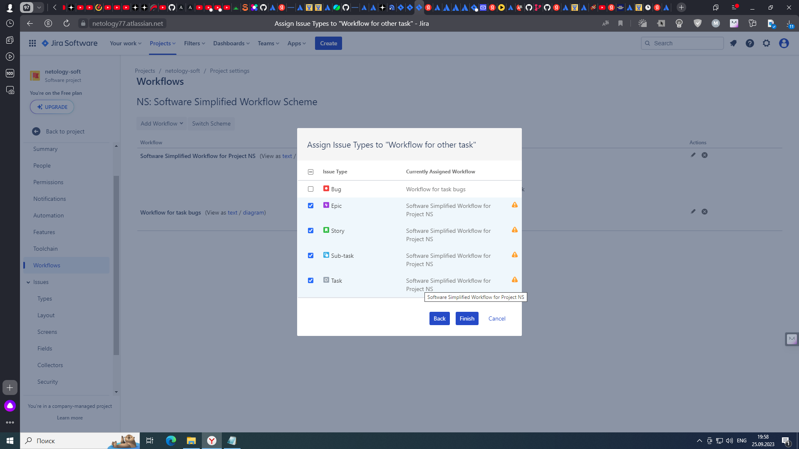
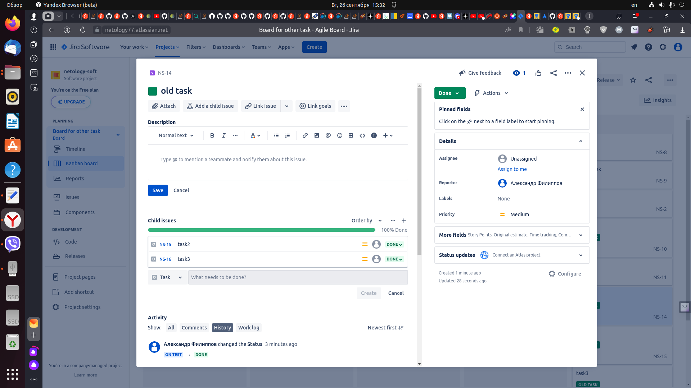

# Домашнее задание к занятию 7 «Жизненный цикл ПО»

## Подготовка к выполнению

1. Получить бесплатную версию [Jira](https://www.atlassian.com/ru/software/jira/free).
2. Настроить её для своей команды разработки.
3. Создать доски Kanban и Scrum.
4. [Дополнительные инструкции от разработчика Jira](https://support.atlassian.com/jira-cloud-administration/docs/import-and-export-issue-workflows/).

## Основная часть

Необходимо создать собственные workflow для двух типов задач: bug и остальные типы задач. Задачи типа bug должны проходить жизненный цикл:

1. Open -> On reproduce.
2. On reproduce -> Open, Done reproduce.
3. Done reproduce -> On fix.
4. On fix -> On reproduce, Done fix.
5. Done fix -> On test.
6. On test -> On fix, Done.
7. Done -> Closed, Open.

Остальные задачи должны проходить по упрощённому workflow:

1. Open -> On develop.
2. On develop -> Open, Done develop.
3. Done develop -> On test.
4. On test -> On develop, Done.
5. Done -> Closed, Open.

**Что нужно сделать**

1. Создайте задачу с типом bug, попытайтесь провести его по всему workflow до Done. 
1. Создайте задачу с типом epic, к ней привяжите несколько задач с типом task, проведите их по всему workflow до Done. 
1. При проведении обеих задач по статусам используйте kanban. 
1. Верните задачи в статус Open.
1. Перейдите в Scrum, запланируйте новый спринт, состоящий из задач эпика и одного бага, стартуйте спринт, проведите задачи до состояния Closed. Закройте спринт.
2. Если всё отработалось в рамках ожидания — выгрузите схемы workflow для импорта в XML. Файлы с workflow и скриншоты workflow приложите к решению задания.

## Решение

1. Создаем board kanban и заполняем необходимые колонки для задач типа bugs

  

2. Создаем workflow на основе ранее созданной board kanban для задач типа bugs и настраиваем необходимые переходы статусов

  

3. Связываем новый workflow с типом проблемы (bugs)

  

  

4. Создаем board kanban и заполняем необходимые колонки для остальных типов задач 

  

5. Создаем workflow на основе ранее созданной board kanban для остальных типов задач и настраиваем необходимые переходы статусов

  

6. Связываем новый workflow для остальных типов задач

  

  

7. Проверяем состав workflow для типов задач

  

8. Создаем задачу с типом bug, и проводим ее по всему workflow до Done.

  

9. Создаем задачу с типом epic, привязываем к ней несколько задач с типом task, и проводим их по всему workflow до Done.

  

  

  

  

10. Возвращаем задачи в статус Open.

  

---

### Как оформить решение задания

Выполненное домашнее задание пришлите в виде ссылки на .md-файл в вашем репозитории.

---
