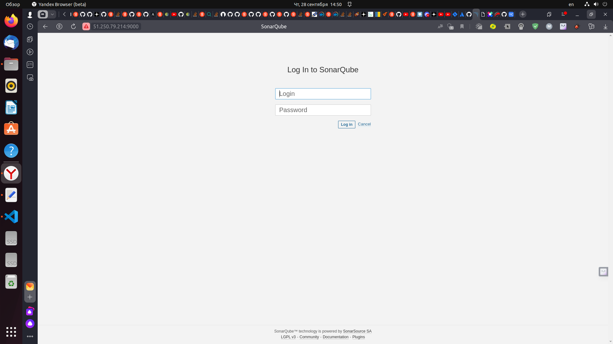

# Домашнее задание к занятию 9 «Процессы CI/CD»

## Подготовка к выполнению

1. Создайте два VM в Yandex Cloud с параметрами: 2CPU 4RAM Centos7 (остальное по минимальным требованиям).
2. Пропишите в [inventory](./infrastructure/inventory/cicd/hosts.yml) [playbook](./infrastructure/site.yml) созданные хосты.
3. Добавьте в [files](./infrastructure/files/) файл со своим публичным ключом (id_rsa.pub). Если ключ называется иначе — найдите таску в плейбуке, которая использует id_rsa.pub имя, и исправьте на своё.
4. Запустите playbook, ожидайте успешного завершения.
5. Проверьте готовность SonarQube через [браузер](http://localhost:9000).
6. Зайдите под admin\admin, поменяйте пароль на свой.
7.  Проверьте готовность Nexus через [бразуер](http://localhost:8081).
8. Подключитесь под admin\admin123, поменяйте пароль, сохраните анонимный доступ.

## Знакомоство с SonarQube

### Основная часть

1. Создайте новый проект, название произвольное.
2. Скачайте пакет sonar-scanner, который вам предлагает скачать SonarQube.
3. Сделайте так, чтобы binary был доступен через вызов в shell (или поменяйте переменную PATH, или любой другой, удобный вам способ).
4. Проверьте `sonar-scanner --version`.
5. Запустите анализатор против кода из директории [example](./example) с дополнительным ключом `-Dsonar.coverage.exclusions=fail.py`.
6. Посмотрите результат в интерфейсе.
7. Исправьте ошибки, которые он выявил, включая warnings.
8. Запустите анализатор повторно — проверьте, что QG пройдены успешно.
9. Сделайте скриншот успешного прохождения анализа, приложите к решению ДЗ.

## Знакомство с Nexus

### Основная часть

1. В репозиторий `maven-public` загрузите артефакт с GAV-параметрами:

 *    groupId: netology;
 *    artifactId: java;
 *    version: 8_282;
 *    classifier: distrib;
 *    type: tar.gz.
   
2. В него же загрузите такой же артефакт, но с version: 8_102.
3. Проверьте, что все файлы загрузились успешно.
4. В ответе пришлите файл `maven-metadata.xml` для этого артефекта.

### Знакомство с Maven

### Подготовка к выполнению

1. Скачайте дистрибутив с [maven](https://maven.apache.org/download.cgi).
2. Разархивируйте, сделайте так, чтобы binary был доступен через вызов в shell (или поменяйте переменную PATH, или любой другой, удобный вам способ).
3. Удалите из `apache-maven-<version>/conf/settings.xml` упоминание о правиле, отвергающем HTTP- соединение — раздел mirrors —> id: my-repository-http-unblocker.
4. Проверьте `mvn --version`.
5. Заберите директорию [mvn](./mvn) с pom.

### Основная часть

1. Поменяйте в `pom.xml` блок с зависимостями под ваш артефакт из первого пункта задания для Nexus (java с версией 8_282).
2. Запустите команду `mvn package` в директории с `pom.xml`, ожидайте успешного окончания.
3. Проверьте директорию `~/.m2/repository/`, найдите ваш артефакт.
4. В ответе пришлите исправленный файл `pom.xml`.


## Решение
## Подготовка к выполнению

1. Создаем два VM в Yandex Cloud с параметрами: 2CPU 4RAM Centos7 (остальное по минимальным требованиям).
<p align="center">
  
</p>
2. Прописываем в [inventory](./infrastructure/inventory/cicd/hosts.yml) [playbook](./infrastructure/site.yml) созданные хосты.
```
all:
  hosts:
    sonar-01:
      ansible_host: 51.250.79.214
    nexus-01:
      ansible_host: 158.160.121.169
  children:
    sonarqube:
      hosts:
        sonar-01:
    nexus:
      hosts:
        nexus-01:
    postgres:
      hosts:
        sonar-01:
  vars:
    ansible_connection_type: paramiko
    ansible_user: aleksander
```
3. Добавляем в [files](./infrastructure/files/) файл со своим публичным ключом (id_rsa.pub).
4. Запускаем playbook с помощью команды ***ansible-playbook -i inventory/cicd/hosts.yml site.yml***, результат выполнения:
<p align="center">
  
</p>
5. Проверяем готовность SonarQube через [браузер](http://51.250.79.214:9000).
<p align="center">
  
</p>
6. Заходим под admin\admin, меняем пароль на свой.
<p align="center">
  
</p>
7.  Проверяем готовность Nexus через [браузер](http://158.160.121.169:8081).
<p align="center">
  
</p>
8. Подключаемся под admin\admin123, меняем пароль в течение 15 секю после авторизации, сохраняем анонимный доступ.
<p align="center">
  
</p>

## Знакомоство с SonarQube

### Основная часть

1. Создаем новый проект.
<p align="center">
  
</p>
2. Скачиваем пакет sonar-scanner, который нам предлагает скачать SonarQube и выполняем его распаковку в директорию с ДЗ.
Provide a token
aleksander: 8dd27f82ad5d4621064fd85f1aeffec0f4d2d6d8
<p align="center">
  
</p>
3. Чтобы binary был доступен меняем переменную PATH ***$ export PATH=$(pwd):$PATH***.
4. Проверяем `sonar-scanner --version`.
```
aleksander@aleksander-MS-7641:~/mnt-homeworks/09-ci-03-cicd$ sonar-scanner --version
INFO: Scanner configuration file: /home/aleksander/mnt-homeworks/09-ci-03-cicd/sonar-scanner-5.0.1.3006-linux/conf/sonar-scanner.properties
INFO: Project root configuration file: NONE
INFO: SonarScanner 5.0.1.3006
INFO: Java 17.0.7 Eclipse Adoptium (64-bit)
INFO: Linux 6.2.0-33-generic amd64
```
5. Запускаем анализатор против кода из директории [example](./example) с дополнительным ключом `-Dsonar.coverage.exclusions=fail.py`.
```
aleksander@aleksander-MS-7641:~/mnt-homeworks/09-ci-03-cicd$ sonar-scanner   -Dsonar.projectKey=netology-soft   -Dsonar.sources=.   -Dsonar.host.url=http://51.250.79.214:9000   -Dsonar.login=8dd27f82ad5d4621064fd85f1aeffec0f4d2d6d8  -Dsonar.coverage.exclusions=fail.py
INFO: Scanner configuration file: /home/aleksander/mnt-homeworks/09-ci-03-cicd/sonar-scanner-5.0.1.3006-linux/conf/sonar-scanner.properties
INFO: Project root configuration file: NONE
INFO: SonarScanner 5.0.1.3006
INFO: Java 17.0.7 Eclipse Adoptium (64-bit)
INFO: Linux 6.2.0-33-generic amd64
INFO: User cache: /home/aleksander/.sonar/cache
INFO: Analyzing on SonarQube server 9.1.0
INFO: Default locale: "ru_RU", source code encoding: "UTF-8" (analysis is platform dependent)
INFO: Load global settings
INFO: Load global settings (done) | time=115ms
INFO: Server id: 9CFC3560-AYrbmUwjlYiIi4dsnRGX
INFO: User cache: /home/aleksander/.sonar/cache
INFO: Load/download plugins
INFO: Load plugins index
INFO: Load plugins index (done) | time=94ms
INFO: Load/download plugins (done) | time=16366ms
INFO: Process project properties
INFO: Process project properties (done) | time=7ms
INFO: Execute project builders
INFO: Execute project builders (done) | time=2ms
INFO: Project key: netology-soft
INFO: Base dir: /home/aleksander/mnt-homeworks/09-ci-03-cicd
INFO: Working dir: /home/aleksander/mnt-homeworks/09-ci-03-cicd/.scannerwork
INFO: Load project settings for component key: 'netology-soft'
INFO: Load project settings for component key: 'netology-soft' (done) | time=51ms
INFO: Load quality profiles
INFO: Load quality profiles (done) | time=95ms
INFO: Load active rules
INFO: Load active rules (done) | time=2824ms
INFO: Indexing files...
INFO: Project configuration:
INFO:   Excluded sources for coverage: fail.py
INFO: 278 files indexed
INFO: 1 file ignored because of scm ignore settings
INFO: Quality profile for py: Sonar way
INFO: Quality profile for xml: Sonar way
INFO: ------------- Run sensors on module netology-soft
INFO: Load metrics repository
INFO: Load metrics repository (done) | time=67ms
INFO: Sensor Python Sensor [python]
WARN: Your code is analyzed as compatible with python 2 and 3 by default. This will prevent the detection of issues specific to python 2 or python 3. You can get a more precise analysis by setting a python version in your configuration via the parameter "sonar.python.version"
INFO: Starting global symbols computation
INFO: 1 source file to be analyzed
INFO: Load project repositories
INFO: Load project repositories (done) | time=32ms
INFO: 1/1 source file has been analyzed
INFO: Starting rules execution
INFO: 1 source file to be analyzed
INFO: 1/1 source file has been analyzed
INFO: Sensor Python Sensor [python] (done) | time=816ms
INFO: Sensor Cobertura Sensor for Python coverage [python]
INFO: Sensor Cobertura Sensor for Python coverage [python] (done) | time=14ms
INFO: Sensor PythonXUnitSensor [python]
INFO: Sensor PythonXUnitSensor [python] (done) | time=5ms
INFO: Sensor CSS Rules [cssfamily]
INFO: No CSS, PHP, HTML or VueJS files are found in the project. CSS analysis is skipped.
INFO: Sensor CSS Rules [cssfamily] (done) | time=3ms
INFO: Sensor JaCoCo XML Report Importer [jacoco]
INFO: 'sonar.coverage.jacoco.xmlReportPaths' is not defined. Using default locations: target/site/jacoco/jacoco.xml,target/site/jacoco-it/jacoco.xml,build/reports/jacoco/test/jacocoTestReport.xml
INFO: No report imported, no coverage information will be imported by JaCoCo XML Report Importer
INFO: Sensor JaCoCo XML Report Importer [jacoco] (done) | time=5ms
INFO: Sensor C# Project Type Information [csharp]
INFO: Sensor C# Project Type Information [csharp] (done) | time=2ms
INFO: Sensor C# Analysis Log [csharp]
INFO: Sensor C# Analysis Log [csharp] (done) | time=11ms
INFO: Sensor C# Properties [csharp]
INFO: Sensor C# Properties [csharp] (done) | time=0ms
INFO: Sensor JavaXmlSensor [java]
INFO: 1 source file to be analyzed
INFO: 1/1 source file has been analyzed
INFO: Sensor JavaXmlSensor [java] (done) | time=197ms
INFO: Sensor HTML [web]
INFO: Sensor HTML [web] (done) | time=4ms
INFO: Sensor XML Sensor [xml]
INFO: 1 source file to be analyzed
INFO: 1/1 source file has been analyzed
INFO: Sensor XML Sensor [xml] (done) | time=176ms
INFO: Sensor VB.NET Project Type Information [vbnet]
INFO: Sensor VB.NET Project Type Information [vbnet] (done) | time=2ms
INFO: Sensor VB.NET Analysis Log [vbnet]
INFO: Sensor VB.NET Analysis Log [vbnet] (done) | time=15ms
INFO: Sensor VB.NET Properties [vbnet]
INFO: Sensor VB.NET Properties [vbnet] (done) | time=0ms
INFO: ------------- Run sensors on project
INFO: Sensor Zero Coverage Sensor
INFO: Sensor Zero Coverage Sensor (done) | time=17ms
INFO: SCM Publisher SCM provider for this project is: git
INFO: SCM Publisher 2 source files to be analyzed
INFO: SCM Publisher 2/2 source files have been analyzed (done) | time=180ms
INFO: CPD Executor Calculating CPD for 1 file
INFO: CPD Executor CPD calculation finished (done) | time=7ms
INFO: Analysis report generated in 114ms, dir size=104,7 kB
INFO: Analysis report compressed in 19ms, zip size=15,9 kB
INFO: Analysis report uploaded in 148ms
INFO: ANALYSIS SUCCESSFUL, you can browse http://51.250.79.214:9000/dashboard?id=netology-soft
INFO: Note that you will be able to access the updated dashboard once the server has processed the submitted analysis report
INFO: More about the report processing at http://51.250.79.214:9000/api/ce/task?id=AYrcD421lYiIi4dsnWLe
INFO: Analysis total time: 6.874 s
INFO: ------------------------------------------------------------------------
INFO: EXECUTION SUCCESS
INFO: ------------------------------------------------------------------------
INFO: Total time: 26.992s
INFO: Final Memory: 18M/74M
INFO: ------------------------------------------------------------------------
```
6. Cмотрим результат в интерфейсе.
 Были найдены:
 - 2 бага (bugs)
 - 2 code smells
<p align="center">
  
</p>
<p align="center">
  
</p>
<p align="center">
  
</p>
<p align="center">
  
</p>
<p align="center">
  
</p>
7. Исправяем ошибки, которые он выявил, включая warnings.
 - fail.py
```
def increment(index = 0):
    index += 1
    return index
def get_square(numb):
    return numb*numb
def print_numb(numb):
    print("Number is {}".format(numb))

index = 0
while (index < 10):
    index = increment(index)
    print(get_square(index))
```

 - pom.xml
```
<project xmlns="http://maven.apache.org/POM/4.0.0" xmlns:xsi="http://www.w3.org/2001/XMLSchema-instance"
  xsi:schemaLocation="http://maven.apache.org/POM/4.0.0 http://maven.apache.org/xsd/maven-4.0.0.xsd">
  <modelVersion>4.0.0</modelVersion>
 
  <groupId>com.netology.app</groupId>
  <artifactId>simple-app</artifactId>
  <version>1.0-SNAPSHOT</version>
   <repositories>
    <repository>
      <id>my-repo</id>
      <name>maven-public</name>
      <url>http://localhost:8081/repository/maven-public/</url>
    </repository>
  </repositories>
  <dependencies>
    <dependency>
      <groupId>somegroup</groupId>
      <artifactId>someart</artifactId>
      <version>somevers</version>
      <classifier>someclass</classifier>
      <type>sometype</type>
    </dependency>
  </dependencies>
</project> 
```
 
8. Запускаем анализатор повторно,  QG пройдены успешно.
<p align="center">
  
</p>


---

### Как оформить решение задания

Выполненное домашнее задание пришлите в виде ссылки на .md-файл в вашем репозитории.

---
