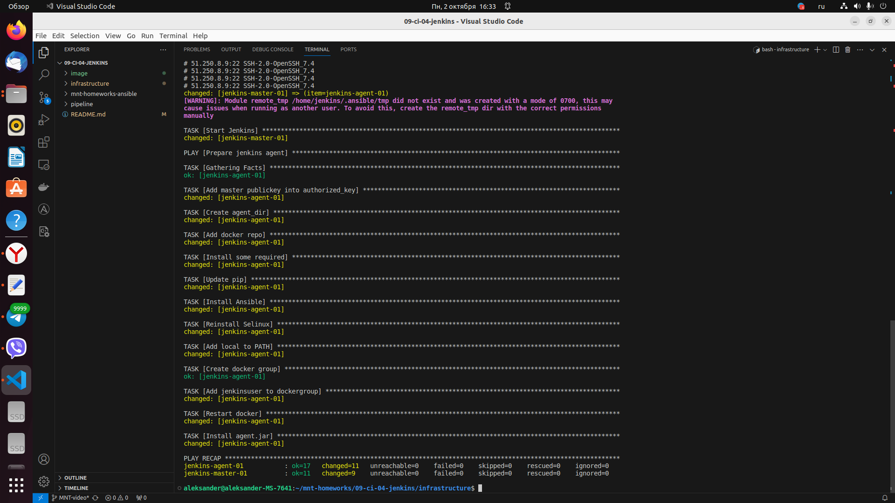
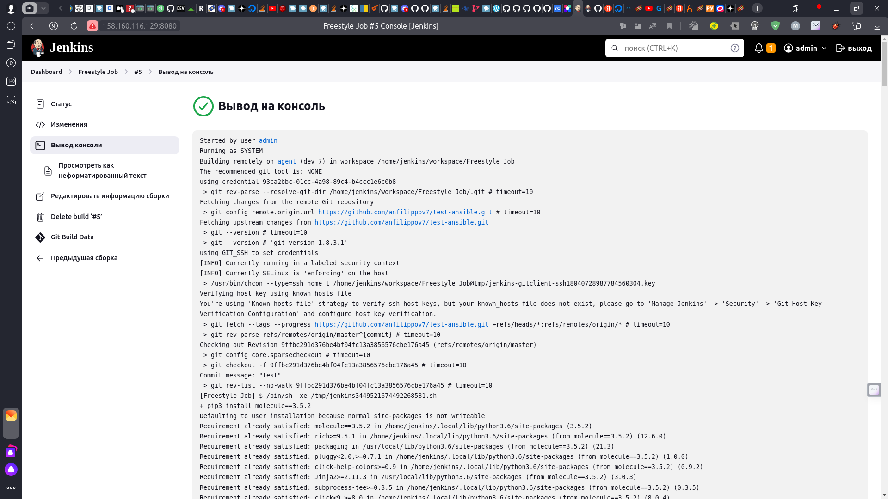
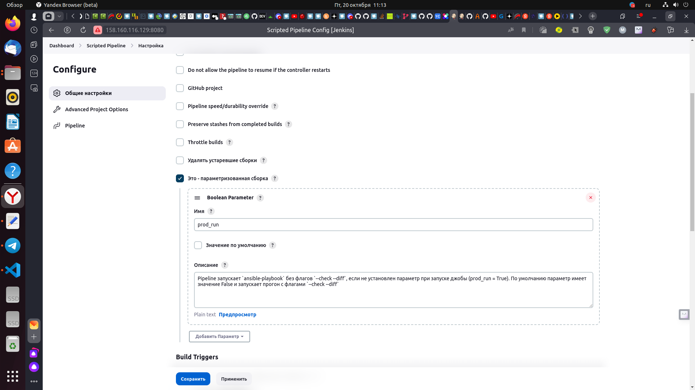

# Домашнее задание к занятию 10 «Jenkins»

## Подготовка к выполнению

1. Создать два VM: для jenkins-master и jenkins-agent.
2. Установить Jenkins при помощи playbook.
3. Запустить и проверить работоспособность.
4. Сделать первоначальную настройку.

## Основная часть

1. Сделать Freestyle Job, который будет запускать `molecule test` из любого вашего репозитория с ролью.
2. Сделать Declarative Pipeline Job, который будет запускать `molecule test` из любого вашего репозитория с ролью.
3. Перенести Declarative Pipeline в репозиторий в файл `Jenkinsfile`.
4. Создать Multibranch Pipeline на запуск `Jenkinsfile` из репозитория.
5. Создать Scripted Pipeline, наполнить его скриптом из [pipeline](./pipeline).
6. Внести необходимые изменения, чтобы Pipeline запускал `ansible-playbook` без флагов `--check --diff`, если не установлен параметр при запуске джобы (prod_run = True). По умолчанию параметр имеет значение False и запускает прогон с флагами `--check --diff`.
7. Проверить работоспособность, исправить ошибки, исправленный Pipeline вложить в репозиторий в файл `ScriptedJenkinsfile`.
8. Отправить ссылку на репозиторий с ролью и Declarative Pipeline и Scripted Pipeline.

## Необязательная часть

1. Создать скрипт на groovy, который будет собирать все Job, завершившиеся хотя бы раз неуспешно. Добавить скрипт в репозиторий с решением и названием `AllJobFailure.groovy`.
2. Создать Scripted Pipeline так, чтобы он мог сначала запустить через Yandex Cloud CLI необходимое количество инстансов, прописать их в инвентори плейбука и после этого запускать плейбук. Мы должны при нажатии кнопки получить готовую к использованию систему.

---

### Как оформить решение задания

Выполненное домашнее задание пришлите в виде ссылки на .md-файл в вашем репозитории.

## Решение

## Подготовка к выполнению

1. Создаем две VM: для jenkins-master и jenkins-agent
<p align="center">
  
</p>
2. Устанавливаем Jenkins при помощи playbook, команды ***ansible-playbook -i inventory/cicd/hosts.yml site.yml***.
<p align="center">
  
</p>
3. Запускаем и проверяем работоспособность.
<p align="center">
  
</p>
4. Делаем первоначальную настройку.
 - получаем пароль 
<p align="center">
  
</p>
 - вводим полученный пароль в поле и выполняем начальную настройку
 - добавляем публичный ключ в authorized_key на ноде agent, изменяем права у authorized_key, читаем и копируем закрытый ключ для дальнейшей вставки его в jenkins

```
aleksander@aleksander-MS-7641:~$ ssh jenkins@158.160.75.194
[jenkins@jenkins-agent ~]$ cat ~/.ssh/id_rsa.pub >> ~/.ssh/authorized_keys
[jenkins@jenkins-agent ~]$ chmod 600 ~/.ssh/authorized_keys
[jenkins@jenkins-agent ~]$ cat ~/.ssh/id_rsa
```

<p align="center">
  
</p>
<p align="center">
  
</p>
<p align="center">
  
</p>

## Основная часть

1. Делаем Freestyle Job, которая будет запускать `molecule test` из репозитория с ролью.
<p align="center">
  
</p>
<p align="center">
  
</p>
<p align="center">
  
</p>
<p align="center">
  
</p>

 - выполняем запуск сборки, сборка №5 прошла успешно
<p align="center">
  
</p>
<p align="center">
  
</p>
<p align="center">
  
</p>
<p align="center">
  
</p>
 
2. Делаем Declarative Pipeline Job, который будет запускать `molecule test` из любого репозитория с ролью.
 - Создаем Declarative Pipeline Job
 - в настройках выбираем GitHub project и прописвваем url нашего проета
 - создаем скрипт следующего содержания
```
pipeline {
    agent {
        label 'ansible'
    }
    stages {
        stage('Install requirements') {
            steps {
                sh 'pip3 install "molecule==3.5.2"'
                sh 'pip3 install "molecule_docker==1.1.0" "molecule_podman==1.1.0"'
                sh 'pip3 install ansible-lint yamllint'
                sh 'pip3 install ansible-lint yamllint'
                sh 'ansible-galaxy collection install community.docker:2.7.6'
                sh 'pip3 install "requests==2.24.0"'
            }
        }
        stage('Molecule test') {
            steps {
                sh 'cd playbooks/roles/vector-role && molecule test'
            }
        }
    }
}
```

<p align="center">
  
</p>

 - Запускаем выполнеение с помощью кнопки ***собрать сейчас***
 - Сборка выполнилась успешно
 <p align="center">
  
</p> 
<p align="center">
  
</p> 
<p align="center">
  
</p> 

3. Перенносим Declarative Pipeline в репозиторий в файл `Jenkinsfile`.
 - В репозитории на GitHub с нашей ролью создаем Jenkinsfile, переносим в него код из скрипта и сохраняем изменения
<p align="center">
  
</p>

4. Создаем Multibranch Pipeline на запуск `Jenkinsfile` из репозитория, выполняем необходимые настройки, производим запуск.
<p align="center">
  
</p> 
<p align="center">
  
</p> 

5. Создаем Scripted Pipeline, наполняем его скриптом из [pipeline](./pipeline).
```
node("ansible"){
    stage("Git checkout"){
        git url: 'https://github.com/aragastmatb/example-playbook.git'
    }
    stage("Sample define secret_check"){
        secret_check=true
    }
    stage("Run playbook"){
        if (secret_check){
            sh 'ansible-playbook site.yml -i inventory/prod.yml'
        }
        else{
            echo 'need more action'
        }
        
    }
}
```
 - выполняем
<p align="center">
  
</p>

6. Внести необходимые изменения, чтобы Pipeline запускал `ansible-playbook` без флагов `--check --diff`, если не установлен параметр при запуске джобы (prod_run = True). По умолчанию параметр имеет значение False и запускает прогон с флагами `--check --diff`.

 - в настройках Pipeline ставим флажек ***параметризированная сборка***
 - создаем ***Boolean Parameter*** ***prod_run***
<p align="center">
  
</p>
 - редактируем скрипт

```
node("ansible"){
    stage("Git checkout"){
        git url: 'https://github.com/aragastmatb/example-playbook.git'
    }
    stage("Sample define secret_check"){
        secret_check="$prod_run"
    }
    stage("Run playbook"){
        if (secret_check=="true") {
            sh 'ansible-playbook site.yml -i inventory/prod.yml'
        }
        else{
            sh 'ansible-playbook site.yml -i inventory/prod.yml --check --diff'
        }
        
    }
}
```

7. Проверяем работоспособность, исправляем ошибки, исправленный Pipeline выкладываем в репозиторий в файл `ScriptedJenkinsfile`.
 - выполняем Pipeline без флага ***prod_run*** (prod_run = false)
<p align="center">
  
</p>
<p align="center">
  
</p>
 - выполняем Pipeline c флагом ***prod_run*** (prod_run = true)
<p align="center">
  
</p>
<p align="center">
  
</p>
8. Отправить ссылку на репозиторий с ролью и Declarative Pipeline и Scripted Pipeline.


---
