# Домашнее задание к занятию 11 «Teamcity»

## Подготовка к выполнению

1. В Yandex Cloud создайте новый инстанс (4CPU4RAM) на основе образа `jetbrains/teamcity-server`.
2. Дождитесь запуска teamcity, выполните первоначальную настройку.
3. Создайте ещё один инстанс (2CPU4RAM) на основе образа `jetbrains/teamcity-agent`. Пропишите к нему переменную окружения `SERVER_URL: "http://<teamcity_url>:8111"`.
4. Авторизуйте агент.
5. Сделайте fork [репозитория](https://github.com/aragastmatb/example-teamcity).
6. Создайте VM (2CPU4RAM) и запустите [playbook](./infrastructure).

## Основная часть

1. Создайте новый проект в teamcity на основе fork.
2. Сделайте autodetect конфигурации.
3. Сохраните необходимые шаги, запустите первую сборку master.
4. Поменяйте условия сборки: если сборка по ветке `master`, то должен происходит `mvn clean deploy`, иначе `mvn clean test`.
5. Для deploy будет необходимо загрузить [settings.xml](./teamcity/settings.xml) в набор конфигураций maven у teamcity, предварительно записав туда креды для подключения к nexus.
6. В pom.xml необходимо поменять ссылки на репозиторий и nexus.
7. Запустите сборку по master, убедитесь, что всё прошло успешно и артефакт появился в nexus.
8. Мигрируйте `build configuration` в репозиторий.
9. Создайте отдельную ветку `feature/add_reply` в репозитории.
10. Напишите новый метод для класса Welcomer: метод должен возвращать произвольную реплику, содержащую слово `hunter`.
11. Дополните тест для нового метода на поиск слова `hunter` в новой реплике.
12. Сделайте push всех изменений в новую ветку репозитория.
13. Убедитесь, что сборка самостоятельно запустилась, тесты прошли успешно.
14. Внесите изменения из произвольной ветки `feature/add_reply` в `master` через `Merge`.
15. Убедитесь, что нет собранного артефакта в сборке по ветке `master`.
16. Настройте конфигурацию так, чтобы она собирала `.jar` в артефакты сборки.
17. Проведите повторную сборку мастера, убедитесь, что сбора прошла успешно и артефакты собраны.
18. Проверьте, что конфигурация в репозитории содержит все настройки конфигурации из teamcity.
19. В ответе пришлите ссылку на репозиторий.


## Решение

1. Создаем новый проект в teamcity на основе fork.
<p align="center">
  
</p>

2. Делаем autodetect конфигурации.
<p align="center">
  
</p>

3. Сохраняем необходимые шаги, запускаем первую сборку master.
<p align="center">
  
</p>
<p align="center">
  
</p>

4. Создаем два шага сборки: если сборка по ветке `master`, то выполняется `clean deploy`, иначе `clean test`.
<p align="center">
  
</p>

5. Для выполнения deploy загружаем [settings.xml](./teamcity/settings.xml) в набор конфигураций maven у teamcity, предварительно записав туда креды для подключения к nexus.
<p align="center">
  
</p>

6. В pom.xml меняeм ссылки на репозиторий и nexus.

```
<?xml version="1.0" encoding="UTF-8"?>
<project xmlns="http://maven.apache.org/POM/4.0.0" xmlns:xsi="http://www.w3.org/2001/XMLSchema-instance"
	xsi:schemaLocation="http://maven.apache.org/POM/4.0.0 https://maven.apache.org/xsd/maven-4.0.0.xsd">
	<modelVersion>4.0.0</modelVersion>
	
	<groupId>org.netology</groupId>
	<artifactId>plaindoll</artifactId>
	<packaging>jar</packaging>
	<version>0.0.1</version>

	<properties>
		<maven.compiler.source>1.8</maven.compiler.source>
		<maven.compiler.target>1.8</maven.compiler.target>
	</properties>
	<distributionManagement>
		<repository>
				<id>nexus</id>
				<url>http://130.193.48.211:8081/repository/maven-releases</url>
		</repository>
	</distributionManagement>
	<dependencies>
		<dependency>
			<groupId>junit</groupId>
			<artifactId>junit</artifactId>
			<version>4.12</version>
			<scope>test</scope>
		</dependency>
	</dependencies>

	<build>
		<plugins>
			<plugin>
				<groupId>org.apache.maven.plugins</groupId>
				<artifactId>maven-shade-plugin</artifactId>
				<version>3.2.4</version>
				<executions>
					<execution>
						<phase>package</phase>
						<goals>
							<goal>shade</goal>
						</goals>
						<configuration>
							<transformers>
								<transformer implementation="org.apache.maven.plugins.shade.resource.ManifestResourceTransformer">
									<mainClass>plaindoll.HelloPlayer</mainClass>
								</transformer>
							</transformers>
						</configuration>
					</execution>
				</executions>
			</plugin>
		</plugins>
	</build>

</project>
```

7. Запускаем сборку по master, убеждаемся, что всё прошло успешно и артефакт появился в nexus.
<p align="center">
  
</p>

<p align="center">
  
</p>

<p align="center">
  
</p>

8. Мигрируем `build configuration` в репозиторий.
 - нажимаем на поле administration
 - переходим на вкладку projects
 - нажимаем на ссылку нашего проекта ***netology_projectФ***
 - далее переходим на вкладку ***Versioned Settings***
 - выбираем пункт ***Synchronization enabled***
 - нажимаем ***Apply***
 - далее нажимаем ***Commit current project settings…***
 
результат выполнения:
<p align="center">
  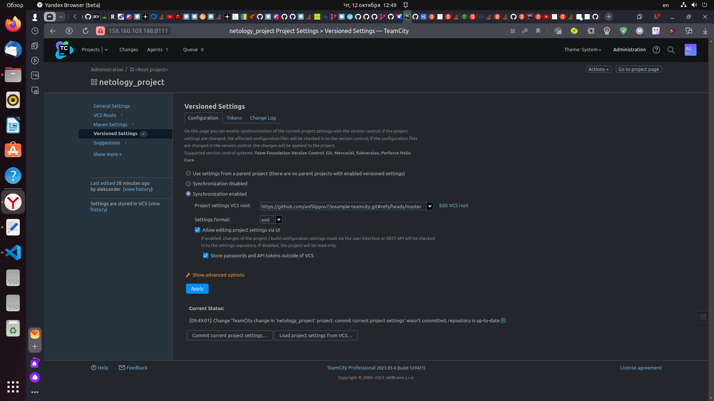
</p>

<p align="center">
  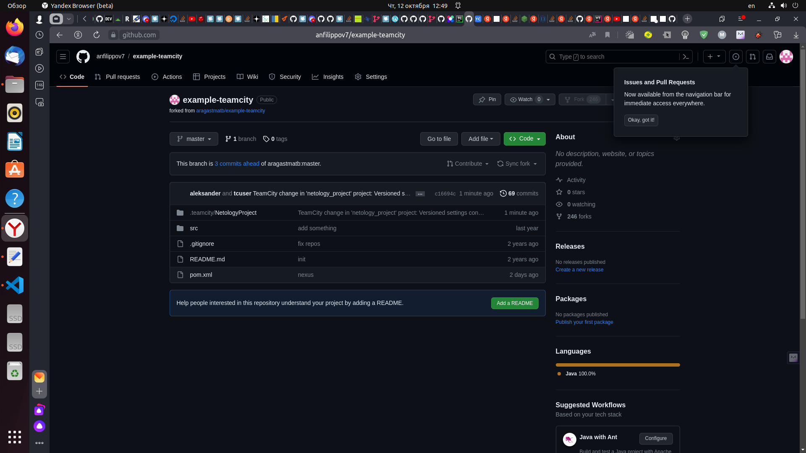
</p>

<p align="center">
  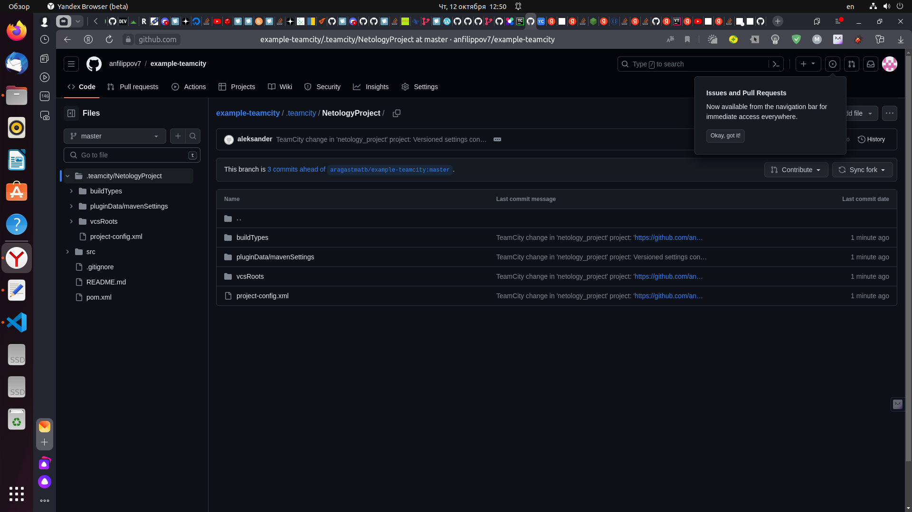
</p>

9. Создаем отдельную ветку `feature/add_reply` в репозитории.
<p align="center">
  
</p>

10. Дополняем класс Welcomer новым методом, которая возвращаем реплику: ***"hunter in the way"***

```
package plaindoll;

public class Welcomer{
	public String sayWelcome() {
		return "Welcome home, good hunter. What is it your desire?";
	}
	public String sayFarewell() {
		return "Farewell, good hunter. May you find your worth in waking world.";
	}
	public String sayNeedGold(){
		return "Not enough gold";
	}
	public String saySome(){
		return "something in the way";
	}
	public String sayHunter(){
		return "hunter in the way";
	}
}
```

11. Дополняем тест для нового метода на поиск слова `hunter` в новой реплике.

```
package plaindoll;

import static org.hamcrest.CoreMatchers.containsString;
import static org.junit.Assert.*;

import org.junit.Test;

public class WelcomerTest {
	
	private Welcomer welcomer = new Welcomer();

	@Test
	public void welcomerSaysWelcome() {
		assertThat(welcomer.sayWelcome(), containsString("Welcome"));
	}
	@Test
	public void welcomerSaysFarewell() {
		assertThat(welcomer.sayFarewell(), containsString("Farewell"));
	}
	@Test
	public void welcomerSaysHunter() {
		assertThat(welcomer.sayWelcome(), containsString("hunter"));
		assertThat(welcomer.sayFarewell(), containsString("hunter"));
		assertThat(welcomer.sayHunter(), containsString("hunter"));
	}
	@Test
	public void welcomerSaysSilver(){
		assertThat(welcomer.sayNeedGold(), containsString("gold"));
	}
	@Test
	public void welcomerSaysSomething(){
		assertThat(welcomer.saySome(), containsString("something"));
	}
}
```

12. Делаем push всех изменений в новую ветку репозитория.

```
aleksander@aleksander-MS-7641:~/example-teamcity$ git add .
aleksander@aleksander-MS-7641:~/example-teamcity$ git commit -m "teamcitu 3"
[feature/add_reply 653b37e] teamcitu 3
 1 file changed, 1 deletion(-)
aleksander@aleksander-MS-7641:~/example-teamcity$ git push origin feature/add_reply
Перечисление объектов: 13, готово.
Подсчет объектов: 100% (13/13), готово.
При сжатии изменений используется до 8 потоков
Сжатие объектов: 100% (4/4), готово.
Запись объектов: 100% (7/7), 488 байтов | 244.00 КиБ/с, готово.
Всего 7 (изменений 2), повторно использовано 0 (изменений 0), повторно использовано пакетов 0
remote: Resolving deltas: 100% (2/2), completed with 2 local objects.
To https://github.com/anfilippov7/example-teamcity.git
   c16694c..653b37e  feature/add_reply -> feature/add_reply
```
<p align="center">
  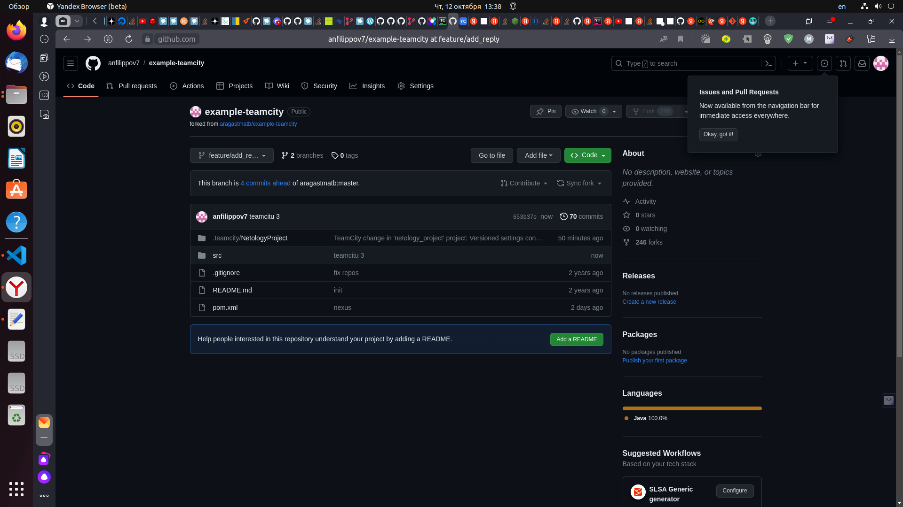
</p>

13. Убеждаемся, что сборка самостоятельно запустилась, тесты прошли успешно.
<p align="center">
  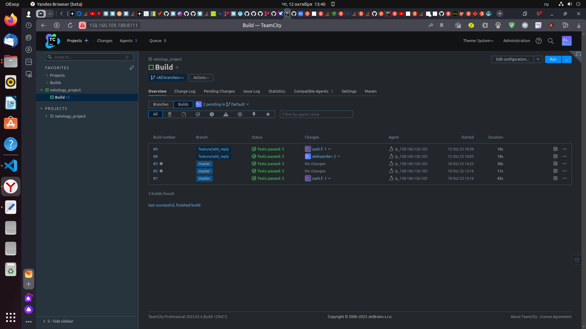
</p>

14. Вносим изменения из произвольной ветки `feature/add_reply` в `master` через `Merge`.

```
aleksander@aleksander-MS-7641:~/example-teamcity$ git branch 
* feature/add_reply
  master
aleksander@aleksander-MS-7641:~/example-teamcity$ git checkout master 
Переключились на ветку «master»
Эта ветка соответствует «origin/master».
aleksander@aleksander-MS-7641:~/example-teamcity$ git merge feature/add_reply
Обновление c16694c..653b37e
Fast-forward
 src/test/java/plaindoll/WelcomerTest.java | 1 -
 1 file changed, 1 deletion(-)
aleksander@aleksander-MS-7641:~/example-teamcity$ git push origin master
Всего 0 (изменений 0), повторно использовано 0 (изменений 0), повторно использовано пакетов 0
To https://github.com/anfilippov7/example-teamcity.git
   c16694c..653b37e  master -> master
```

<p align="center">
  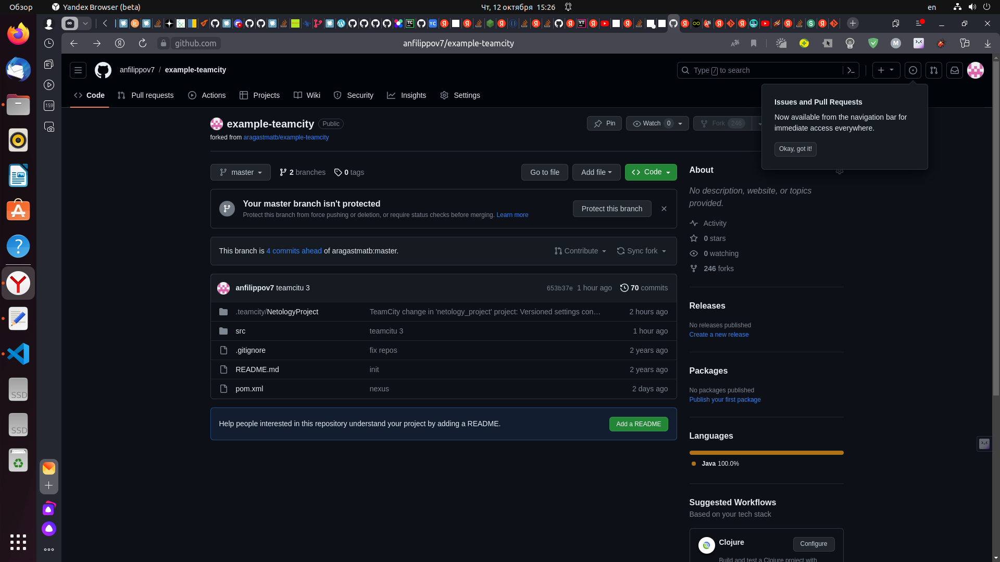
</p>

15. Убеждаемся, что нет собранного артефакта в сборке по ветке `master`.
<p align="center">
  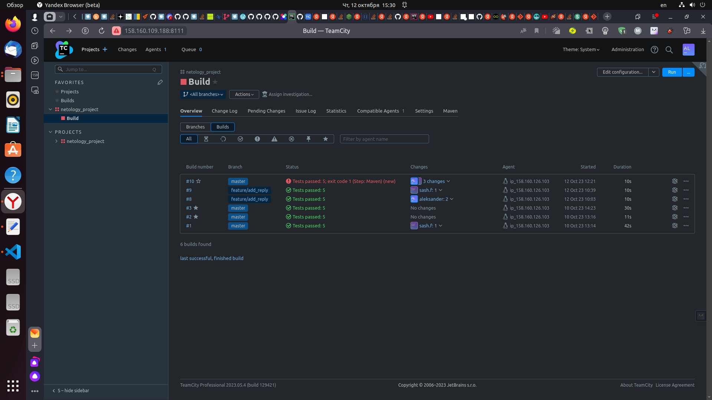
</p>

16. Настраиваем конфигурацию так, чтобы она собирала `.jar` в артефакты сборки.
<p align="center">
  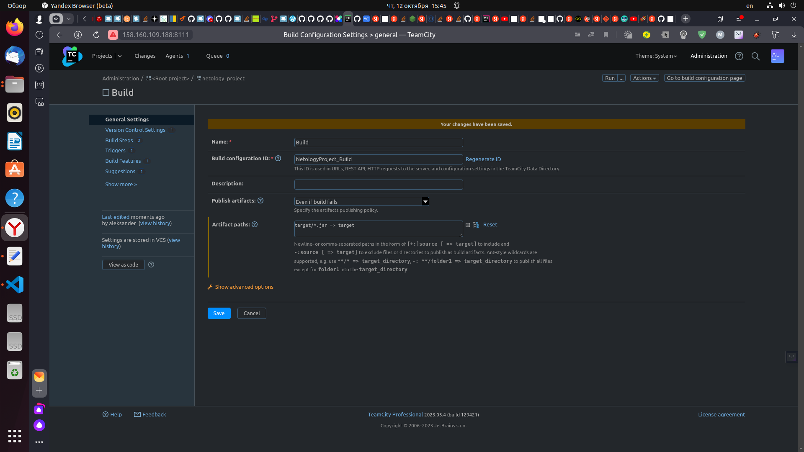
</p>

17. Проводим повторную сборку мастера, исправляем ошибки (меняем версию на 0.0.2, коммитим и пушим в репозиториё)

```
	<groupId>org.netology</groupId>
	<artifactId>plaindoll</artifactId>
	<packaging>jar</packaging>
	<version>0.0.2</version>
```

```
aleksander@aleksander-MS-7641:~/example-teamcity$ git add .
aleksander@aleksander-MS-7641:~/example-teamcity$ git commit -m "teamcity 4"
[master e845a62] teamcity 4
 1 file changed, 1 insertion(+), 1 deletion(-)
aleksander@aleksander-MS-7641:~/example-teamcity$ git push -f
Перечисление объектов: 5, готово.
Подсчет объектов: 100% (5/5), готово.
При сжатии изменений используется до 8 потоков
Сжатие объектов: 100% (3/3), готово.
Запись объектов: 100% (3/3), 313 байтов | 313.00 КиБ/с, готово.
Всего 3 (изменений 2), повторно использовано 0 (изменений 0), повторно использовано пакетов 0
remote: Resolving deltas: 100% (2/2), completed with 2 local objects.
To https://github.com/anfilippov7/example-teamcity.git
 + abcd4cc...e845a62 master -> master (forced update)
```
 - убеждаемся что сборка прошла успешно и артефакты собраны.
<p align="center">
  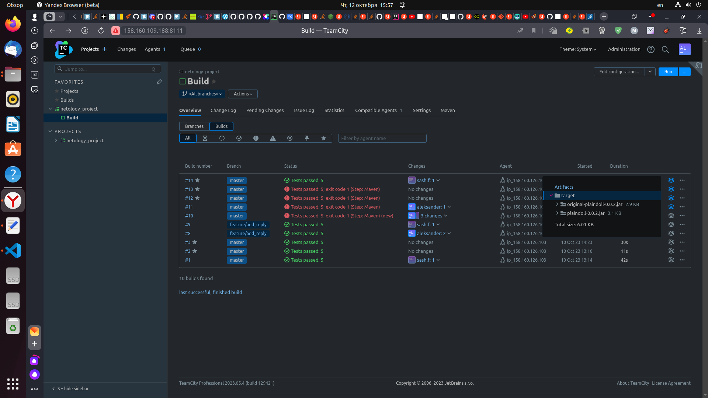
</p> 
<p align="center">
  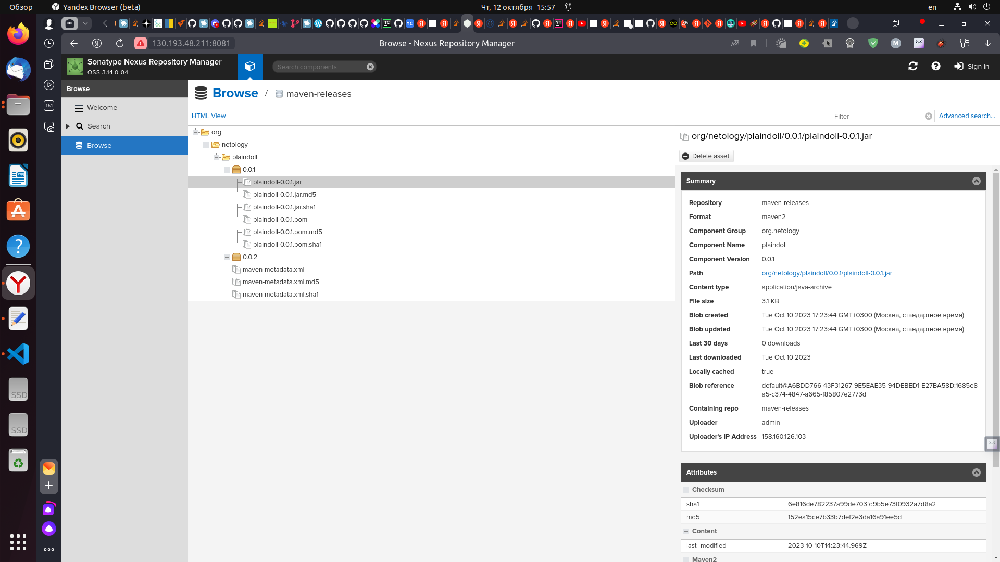
</p>
 
18. Конфигурация в репозитории содержит все настройки конфигурации из teamcity.
<p align="center">
  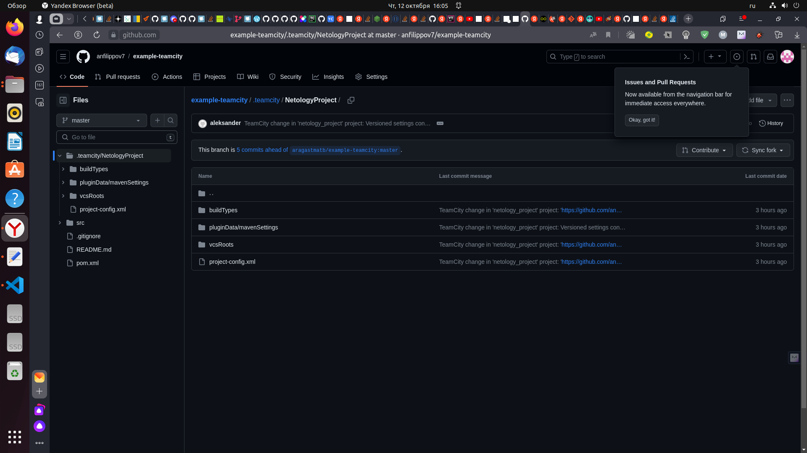
</p>

19. В ответе пришлите ссылку на репозиторий.

---

### Как оформить решение задания

Выполненное домашнее задание пришлите в виде ссылки на .md-файл в вашем репозитории.

---
