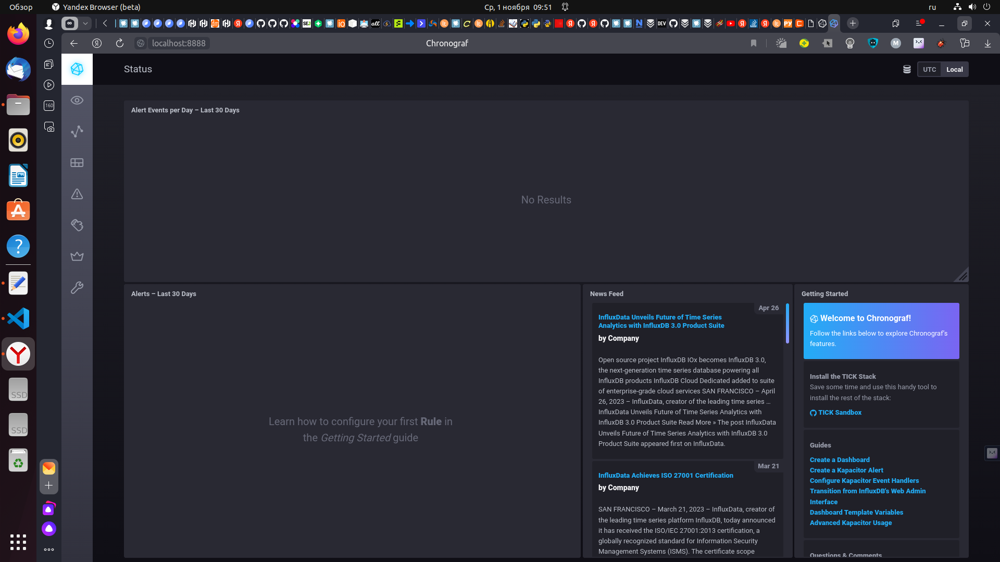
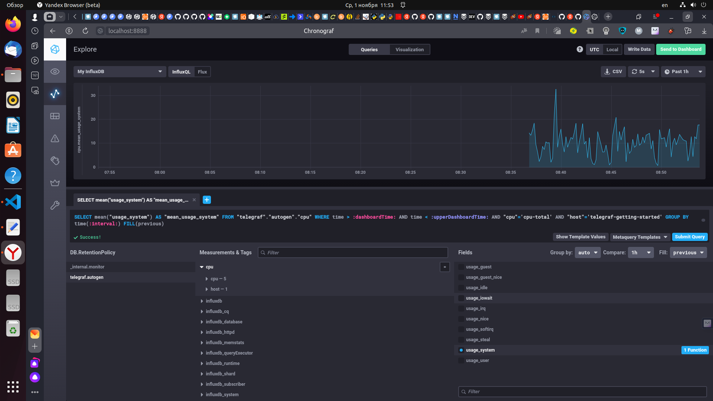
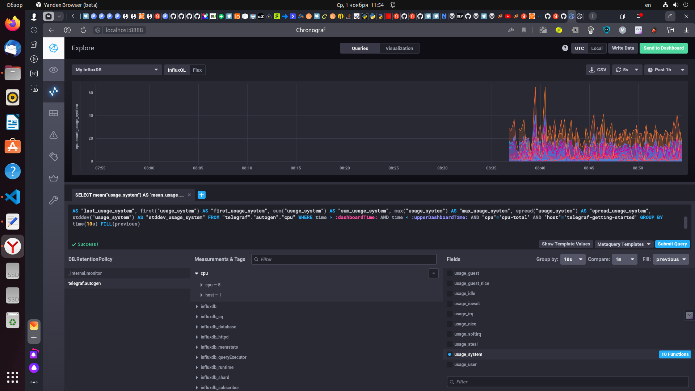
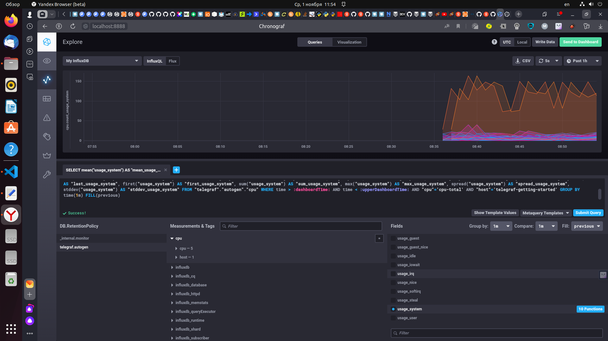
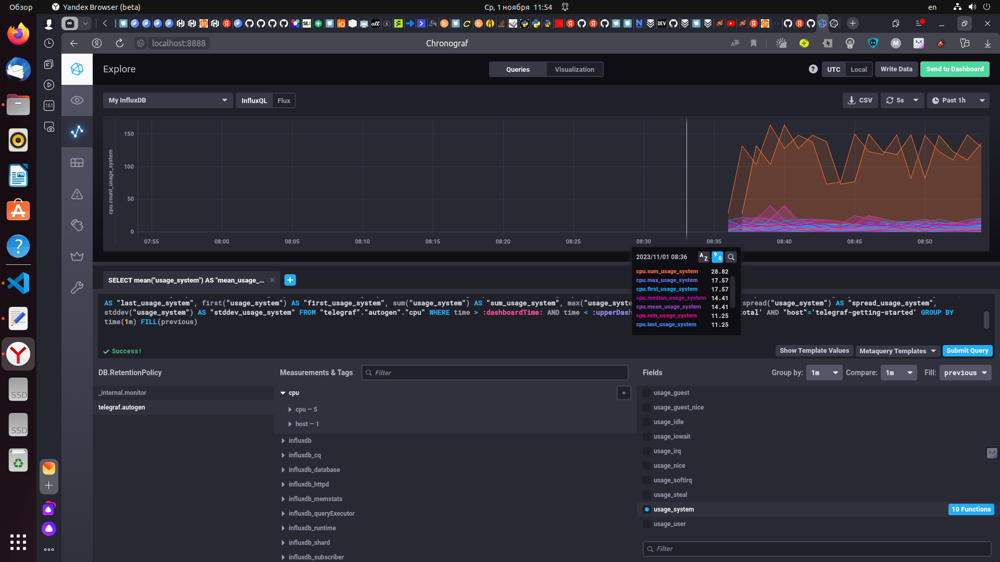
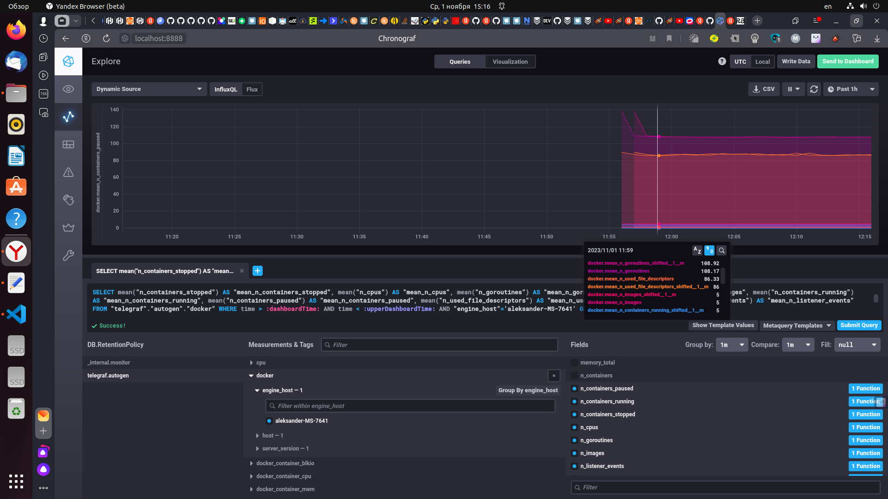

# Домашнее задание к занятию "13.Системы мониторинга"

## Обязательные задания

1. Вас пригласили настроить мониторинг на проект. На онбординге вам рассказали, что проект представляет из себя 
платформу для вычислений с выдачей текстовых отчетов, которые сохраняются на диск. Взаимодействие с платформой 
осуществляется по протоколу http. Также вам отметили, что вычисления загружают ЦПУ. Какой минимальный набор метрик вы
выведите в мониторинг и почему?

## Решение задание 1

Минимальный набор метрик для мониторинга доджен быть такой:
 - необходимо организовать мониторинг загрузки CPU LA, для получения информации о нагрузке на центральный процессор, чтобы понимать хватает ли вычислительной мощности для обработки текущих задач, и есть ли необходимость масштабирования системы или рефакторинга приложения.
 - необходимо организовать мониторинг дисковой системы IOPS (число операций с дисками в секунду), это необходимо для контроля состояния дисковой подсистемы (слишком большие значения данного параметра могут свидетельствовать о проблемах с дисками)
 - необходимо организовать мониториг индексных дескрипторов inodes, для контролирования их переполнение делает невозможным создание новых файлов, очень актуально в нашем случае.
 - необходимо ввести в систему мониторинга метрику FS для контроля наличия свободного места на диске.
 - необходимо также ввести в ситему мониторинга метрику NetTraffic для контроля пропускной способности сетевого трафика, чтобы определить хватает ли для сервиса текушей пропусконой способности.
 - также в систему мониторинга необходимо ввести метрики доступности платформы на основе http кодов ответа, их количества и значения для определения количества неуспешных http-запросов, количества успешных http-запросов и вычисления процента успешных и неуспешных http-запросов.


2. Менеджер продукта посмотрев на ваши метрики сказал, что ему непонятно что такое RAM/inodes/CPUla. Также он сказал, 
что хочет понимать, насколько мы выполняем свои обязанности перед клиентами и какое качество обслуживания. Что вы 
можете ему предложить?

## Решение задание 2

 - необходимые метрики мониторинга и для чего это нужно выше, менеджер проекта может ознакомиться.
 - для получения информации, насколько мы выполняем свои обязанности перед клиентами и какое качество обслуживания, нам необходимо заключить соглашение SLA об уровне обслуживания, целевое качество которого будет описано в SLO, а следить за величиной фактически предоставляемого обслуживания необходимо по SLI.

3. Вашей DevOps команде в этом году не выделили финансирование на построение системы сбора логов. Разработчики в свою 
очередь хотят видеть все ошибки, которые выдают их приложения. Какое решение вы можете предпринять в этой ситуации, 
чтобы разработчики получали ошибки приложения?

## Решение задание 3

 - для построения системы сбора логов пердложу организовать сбор логов с помощью перехватчика ошибок Sentry 

4. Вы, как опытный SRE, сделали мониторинг, куда вывели отображения выполнения SLA=99% по http кодам ответов. 
Вычисляете этот параметр по следующей формуле: summ_2xx_requests/summ_all_requests. Данный параметр не поднимается выше 
70%, но при этом в вашей системе нет кодов ответа 5xx и 4xx. Где у вас ошибка?

## Решение задание 4

 - необходимо скорректировать формулу для учета успешных кодов ответа 3хх, скорректированная формула будет такой: ***(summ_2xx_requests + summ_3xx_requests)/(summ_all_requests)***

5. Опишите основные плюсы и минусы pull и push систем мониторинга.

## Решение задание 5

 Pull модель, инициатор передачи - система мониторинга (выполняет последовательный или параллельный сбор системой мониторинга накопленной информации с агентов), имеет следующие плюсы:
 - позволяют гарантировать доставку и корректность данных, благодаря использованию протокола TCP.
 - легче контролировать подлинность данных, т.к только из указанных источников производиться загрузка данных
 - можно настроить единый proxy сервер(балансировщик) до всех агентов с TLS, это сделает независимыми систему мониторинга и агентов, создаст единую точку доступа и даствозможность баласировки нагрузки
 - упрощённая отладка получения данных с агентов, т.к для получения используется HTTP и дебажить можно через браузер либо curl
 - в pull модели нет проблем с перегрузкой очередей т.к система мониторинга сама забирает данные, мониторинг никогда не станет узким местом системы
 Pull модель минусы:
 - требуется дополнительный механизм обновления списка объектов мониторинга (discovery)
 - необходимо открывать входящие порты на объектах мониторинга
 - плохо ложится на событийную модель сбора метрик, например, для сбора результатов исполнения каких-то разовых задач
 
 Push модель, инициатор передачи - агент (рабочая машина с которой мы собираем мониторинг), имеет следующие плюсы:
 - упрощённая система репликации (на агенте можно указать много резервных нод системы мониторинга)
 - более гибкая настройка отправки пакетов данных с метриками, т.к отправку можно настроить индивидуально на каждом агенте
 - более производительная система т.к UDP легче в передаче пакетов, но при этом может пострадать гарантия доставки пакетов
 Push модель минусы:
 - полное отсутствие информации о состоянии агента, если он не присылает метрики
 - сложнее контролировать подлинность данных

6. Какие из ниже перечисленных систем относятся к push модели, а какие к pull? А может есть гибридные?

    - Prometheus 
    - TICK
    - Zabbix
    - VictoriaMetrics
    - Nagios

## Решение задание 6

 - Prometheus - работает с pull и push моделью
 - TICK - push модель (Telegraf, InfluxDB, Hronograf, Kapacitor. Сам находит сои компоненты, БД можно любую)
 - Zabbix - работает с pull и push моделью (имеется коробочное решение по анализу, и хранению данных - усреднение, глубина ..)
 - VictoriaMetrics - работает с pull и push моделью (поддерживает обе модели)
 - Nagios - основной режим pull и дополнительный push в зависимости от агента

7. Склонируйте себе [репозиторий](https://github.com/influxdata/sandbox/tree/master) и запустите TICK-стэк, 
используя технологии docker и docker-compose.

В виде решения на это упражнение приведите скриншот веб-интерфейса ПО chronograf (`http://localhost:8888`). 

P.S.: если при запуске некоторые контейнеры будут падать с ошибкой - проставьте им режим `Z`, например
`./data:/var/lib:Z`

## Решение задание 7

 - Клонируем репозиторий и запускаем TICK-стэк при помощи команды ***./sandbox up***

```
aleksander@aleksander-MS-7641:~/sandbox$ ./sandbox up
Using latest, stable releases
Spinning up Docker Images...
If this is your first time starting sandbox this might take a minute...
Building influxdb
[+] Building 58.3s (5/5) FINISHED                                                                                                                                  docker:default
 => [internal] load build definition from Dockerfile                                                                                                                         0.0s
 => => transferring dockerfile: 83B                                                                                                                                          0.0s
 => [internal] load .dockerignore                                                                                                                                            0.0s
 => => transferring context: 2B                                                                                                                                              0.0s
 => [internal] load metadata for docker.io/library/influxdb:1.8                                                                                                              1.8s
 => [1/1] FROM docker.io/library/influxdb:1.8@sha256:da78dac8ee0dce55682dee13fc207de2cf086b618bc0ddaa945861860e46efa6                                                       56.5s
 => => resolve docker.io/library/influxdb:1.8@sha256:da78dac8ee0dce55682dee13fc207de2cf086b618bc0ddaa945861860e46efa6                                                        0.0s
 => => sha256:da78dac8ee0dce55682dee13fc207de2cf086b618bc0ddaa945861860e46efa6 776B / 776B                                                                                   0.0s
 => => sha256:2bdb3a557864a3f7bc7be971ff1e355e0c8b87bf9c3586aadecd3c34c9c56bc5 1.78kB / 1.78kB                                                                               0.0s
 => => sha256:2f088d622efd8dbaa13d01eafd0aac8f9f33bb335edd3be897ae8059338c7bf7 55.06MB / 55.06MB                                                                            53.7s
 => => sha256:7a3f93b04c553e324af1781ca74a09b5fa1711f0ee4eef8098abbaea52b16c68 4.67kB / 4.67kB                                                                               0.0s
 => => sha256:de448b80f06437f3025dcaa9285d40c9c81e4be00df1b04bd5a26fd6b9447fc8 15.76MB / 15.76MB                                                                            15.4s
 => => sha256:469105de3319d3732d5d45b2577dd8bbb5a67a20c5f158e7a8d97e07b9c4063b 1.81kB / 1.81kB                                                                               0.2s
 => => sha256:cdad387b329047304e8812566c42f4433f653a63ffa47242f9b5985c4427f1c3 54.89MB / 54.89MB                                                                            53.5s
 => => sha256:b9b6af5df828ff786198caa94e15c1478eec62864bd5ff9e4e068d7ab8d93899 226B / 226B                                                                                  15.6s
 => => sha256:20272ddaf2bf8aa01b23207c163be482dacd6b66798f4c99bfcafebad73d64be 211B / 211B                                                                                  15.8s
 => => sha256:70894489304866ca8a1bed136fba77ec5195c57225c6c5b95adbbf563d453dae 1.28kB / 1.28kB                                                                              16.2s
 => => extracting sha256:2f088d622efd8dbaa13d01eafd0aac8f9f33bb335edd3be897ae8059338c7bf7                                                                                    1.4s
 => => extracting sha256:de448b80f06437f3025dcaa9285d40c9c81e4be00df1b04bd5a26fd6b9447fc8                                                                                    0.3s
 => => extracting sha256:469105de3319d3732d5d45b2577dd8bbb5a67a20c5f158e7a8d97e07b9c4063b                                                                                    0.0s
 => => extracting sha256:cdad387b329047304e8812566c42f4433f653a63ffa47242f9b5985c4427f1c3                                                                                    0.8s
 => => extracting sha256:b9b6af5df828ff786198caa94e15c1478eec62864bd5ff9e4e068d7ab8d93899                                                                                    0.0s
 => => extracting sha256:20272ddaf2bf8aa01b23207c163be482dacd6b66798f4c99bfcafebad73d64be                                                                                    0.0s
 => => extracting sha256:70894489304866ca8a1bed136fba77ec5195c57225c6c5b95adbbf563d453dae                                                                                    0.0s
 => exporting to image                                                                                                                                                       0.0s
 => => exporting layers                                                                                                                                                      0.0s
 => => writing image sha256:9c513194f11c3478e93e4756c8ea4fc0abcade013b107bad7d56f4260e7a3049                                                                                 0.0s
 => => naming to docker.io/library/influxdb                                                                                                                                  0.0s
Building telegraf
[+] Building 66.5s (5/5) FINISHED                                                                                                                                  docker:default
 => [internal] load build definition from Dockerfile                                                                                                                         0.0s
 => => transferring dockerfile: 83B                                                                                                                                          0.0s
 => [internal] load .dockerignore                                                                                                                                            0.0s
 => => transferring context: 2B                                                                                                                                              0.0s
 => [internal] load metadata for docker.io/library/telegraf:latest                                                                                                           1.8s
 => [1/1] FROM docker.io/library/telegraf:latest@sha256:cfc3799fad5bafc689fe92630b2f3bef0561f9e692ddb5d2f12b5a90917a9252                                                    64.7s
 => => resolve docker.io/library/telegraf:latest@sha256:cfc3799fad5bafc689fe92630b2f3bef0561f9e692ddb5d2f12b5a90917a9252                                                     0.0s
 => => sha256:06e8455931683de9212bcf26fb9695ffb84181dffd40310ea7997cb5127790a5 1.58kB / 1.58kB                                                                               0.0s
 => => sha256:cfc3799fad5bafc689fe92630b2f3bef0561f9e692ddb5d2f12b5a90917a9252 776B / 776B                                                                                   0.0s
 => => sha256:f0e412589f82499fa2f37df76113b83db2f4b5ad0d0f0a53a6b38a037fc307d8 4.46kB / 4.46kB                                                                               0.0s
 => => sha256:0a9573503463fd3166b5b1f34a7720dac28609e98d731e50e7068f92e79b8545 49.58MB / 49.58MB                                                                            53.4s
 => => sha256:1ccc26d841b4acc2562483bf393ce1cf8bc358ced09ccd825425226827c79c92 24.05MB / 24.05MB                                                                            30.0s
 => => sha256:b42938defa8a6b527ab4fb0f8be74ac2b7c945f5518627ce9e869533ce2c3050 19.15MB / 19.15MB                                                                            29.0s
 => => sha256:366994b97c2f17c0fe06554587854beea020e47b89b927da0bd69563cf6e7495 1.81kB / 1.81kB                                                                              29.2s
 => => sha256:b6035f855219f18278e34230df671c78e1e19d349d59c7e9ebf605f047b84d1b 57.19MB / 57.19MB                                                                            63.3s
 => => sha256:4c163dbdb23038d9d1bf37a33d281a368f88e6f4725249451d4c5f78e3e9a746 344B / 344B                                                                                  30.2s
 => => extracting sha256:0a9573503463fd3166b5b1f34a7720dac28609e98d731e50e7068f92e79b8545                                                                                    1.4s
 => => extracting sha256:1ccc26d841b4acc2562483bf393ce1cf8bc358ced09ccd825425226827c79c92                                                                                    0.4s
 => => extracting sha256:b42938defa8a6b527ab4fb0f8be74ac2b7c945f5518627ce9e869533ce2c3050                                                                                    0.7s
 => => extracting sha256:366994b97c2f17c0fe06554587854beea020e47b89b927da0bd69563cf6e7495                                                                                    0.0s
 => => extracting sha256:b6035f855219f18278e34230df671c78e1e19d349d59c7e9ebf605f047b84d1b                                                                                    1.0s
 => => extracting sha256:4c163dbdb23038d9d1bf37a33d281a368f88e6f4725249451d4c5f78e3e9a746                                                                                    0.0s
 => exporting to image                                                                                                                                                       0.0s
 => => exporting layers                                                                                                                                                      0.0s
 => => writing image sha256:5df82b60d8e7054c2c96ffce092d94cee5fa7d0eb8d4692601c5d4c27293e093                                                                                 0.0s
 => => naming to docker.io/library/telegraf                                                                                                                                  0.0s
Building kapacitor
[+] Building 98.7s (5/5) FINISHED                                                                                                                                  docker:default
 => [internal] load .dockerignore                                                                                                                                            0.1s
 => => transferring context: 2B                                                                                                                                              0.0s
 => [internal] load build definition from Dockerfile                                                                                                                         0.1s
 => => transferring dockerfile: 85B                                                                                                                                          0.0s
 => [internal] load metadata for docker.io/library/kapacitor:latest                                                                                                          3.4s
 => [1/1] FROM docker.io/library/kapacitor:latest@sha256:67b62dd51abd02077243fac3d514688163705e8209556cc2f8d856809ef91cc2                                                   95.1s
 => => resolve docker.io/library/kapacitor:latest@sha256:67b62dd51abd02077243fac3d514688163705e8209556cc2f8d856809ef91cc2                                                    0.0s
 => => sha256:43f89b94cd7df92a2f7e565b8fb1b7f502eff2cd225508cbd7ea2d36a9a3a601 30.44MB / 30.44MB                                                                            60.6s
 => => sha256:c42c1a5016fb63983b7331918ba3251a006a305a7155f887c55ba0310f14ebe4 7.12MB / 7.12MB                                                                              15.4s
 => => sha256:30239ad5e5d9331355af6421fa6c366b9f628dc79e8975c56206b99c1e540649 32.01MB / 32.01MB                                                                            60.8s
 => => sha256:67b62dd51abd02077243fac3d514688163705e8209556cc2f8d856809ef91cc2 549B / 549B                                                                                   0.0s
 => => sha256:f1dfcb7723d51e98ef4c0b9aaa7b46a9456fbb6ed535bdf90a77b4d9126527d8 1.58kB / 1.58kB                                                                               0.0s
 => => sha256:79b5a5d5782dedbc755b3339e53fd9d287d4661433bd95af1ef0224f23bdda1c 5.54kB / 5.54kB                                                                               0.0s
 => => sha256:b1fbfe092318820088e60dceb97a4a24b1ce15844a6a1a09051f5b4d8ce90534 66.75MB / 66.75MB                                                                            93.5s
 => => sha256:c9f4bbd3375eb73968b92283bc13d2ed8b95bfadbb454c60ef9904a446c99129 224B / 224B                                                                                  77.1s
 => => extracting sha256:43f89b94cd7df92a2f7e565b8fb1b7f502eff2cd225508cbd7ea2d36a9a3a601                                                                                    1.2s
 => => sha256:0dfd748e675c9bd7ad6c1cc855c56bfe36628ce4ada87c4e1bc67f72c0bfa352 231B / 231B                                                                                  77.8s
 => => extracting sha256:c42c1a5016fb63983b7331918ba3251a006a305a7155f887c55ba0310f14ebe4                                                                                    0.5s
 => => extracting sha256:30239ad5e5d9331355af6421fa6c366b9f628dc79e8975c56206b99c1e540649                                                                                    0.4s
 => => extracting sha256:b1fbfe092318820088e60dceb97a4a24b1ce15844a6a1a09051f5b4d8ce90534                                                                                    1.4s
 => => extracting sha256:c9f4bbd3375eb73968b92283bc13d2ed8b95bfadbb454c60ef9904a446c99129                                                                                    0.0s
 => => extracting sha256:0dfd748e675c9bd7ad6c1cc855c56bfe36628ce4ada87c4e1bc67f72c0bfa352                                                                                    0.0s
 => exporting to image                                                                                                                                                       0.0s
 => => exporting layers                                                                                                                                                      0.0s
 => => writing image sha256:8ba820851f638f14e85a0243e6d4dab95760e8eb91494af11907c1fba3b433a2                                                                                 0.0s
 => => naming to docker.io/library/kapacitor                                                                                                                                 0.0s
Building chronograf
[+] Building 47.1s (8/8) FINISHED                                                                                                                                  docker:default
 => [internal] load .dockerignore                                                                                                                                            0.0s
 => => transferring context: 2B                                                                                                                                              0.0s
 => [internal] load build definition from Dockerfile                                                                                                                         0.0s
 => => transferring dockerfile: 199B                                                                                                                                         0.0s
 => [internal] load metadata for docker.io/library/chronograf:latest                                                                                                         8.3s
 => [1/3] FROM docker.io/library/chronograf:latest@sha256:b63b883cc72ee7f1fd939934ce4cf866200493a98670593589112809e0d2271b                                                  38.5s
 => => resolve docker.io/library/chronograf:latest@sha256:b63b883cc72ee7f1fd939934ce4cf866200493a98670593589112809e0d2271b                                                   0.0s
 => => sha256:1a461fbe3edab762b1d59bcedb52e0f8e6b0970978aaea196f8d2cee12c7dcaa 1.58kB / 1.58kB                                                                               0.0s
 => => sha256:578acb154839e9d0034432e8f53756d6f53ba62cf8c7ea5218a2476bf5b58fc9 29.15MB / 29.15MB                                                                            24.5s
 => => sha256:b63b883cc72ee7f1fd939934ce4cf866200493a98670593589112809e0d2271b 776B / 776B                                                                                   0.0s
 => => sha256:3e1dc006b87ef469329f2f30f1c8ccf4a91484765e4f522eb5635326d033295b 4.82kB / 4.82kB                                                                               0.0s
 => => sha256:74552c3cf744ecac6301ccde01a6a900a075b6c630a9f40b8abe29dde4a3e0b3 7.87MB / 7.87MB                                                                               6.3s
 => => sha256:805fc64ace298a45ceda26ee328a12efc77ee97c4ffe0005b9d92adaabe8eb8c 47.05MB / 47.05MB                                                                            37.2s
 => => sha256:9fe49558d81938f5c83cf0c2775ce79b575abaa938b3593a68598c62e4c18664 12.24kB / 12.24kB                                                                             6.5s
 => => sha256:869439d87344d0d0f75a8ae7cc5e6268384d88f988b4e6f4e549c978eb57a8b7 11.90kB / 11.90kB                                                                             6.8s
 => => sha256:cd4a93857ae7d9c3a84b65e983d1c77071a23c7b74179bfcb3fd25b12faa9c16 239B / 239B                                                                                   7.0s
 => => extracting sha256:578acb154839e9d0034432e8f53756d6f53ba62cf8c7ea5218a2476bf5b58fc9                                                                                    1.6s
 => => extracting sha256:74552c3cf744ecac6301ccde01a6a900a075b6c630a9f40b8abe29dde4a3e0b3                                                                                    0.3s
 => => extracting sha256:805fc64ace298a45ceda26ee328a12efc77ee97c4ffe0005b9d92adaabe8eb8c                                                                                    1.2s
 => => extracting sha256:9fe49558d81938f5c83cf0c2775ce79b575abaa938b3593a68598c62e4c18664                                                                                    0.0s
 => => extracting sha256:869439d87344d0d0f75a8ae7cc5e6268384d88f988b4e6f4e549c978eb57a8b7                                                                                    0.0s
 => => extracting sha256:cd4a93857ae7d9c3a84b65e983d1c77071a23c7b74179bfcb3fd25b12faa9c16                                                                                    0.0s
 => [internal] load build context                                                                                                                                            0.0s
 => => transferring context: 481B                                                                                                                                            0.0s
 => [2/3] ADD ./sandbox.src ./usr/share/chronograf/resources/                                                                                                                0.3s
 => [3/3] ADD ./sandbox-kapa.kap ./usr/share/chronograf/resources/                                                                                                           0.0s
 => exporting to image                                                                                                                                                       0.0s
 => => exporting layers                                                                                                                                                      0.0s
 => => writing image sha256:c5d58470c93a2ab795d1034d76f5abe37abc1b6f7932c6f8b6a6b92dcb1638ce                                                                                 0.0s
 => => naming to docker.io/library/chrono_config                                                                                                                             0.0s
Building documentation
[+] Building 9.0s (9/9) FINISHED                                                                                                                                   docker:default
 => [internal] load build definition from Dockerfile                                                                                                                         0.0s
 => => transferring dockerfile: 251B                                                                                                                                         0.0s
 => [internal] load .dockerignore                                                                                                                                            0.0s
 => => transferring context: 2B                                                                                                                                              0.0s
 => [internal] load metadata for docker.io/library/alpine:3.12                                                                                                               6.9s
 => [1/4] FROM docker.io/library/alpine:3.12@sha256:c75ac27b49326926b803b9ed43bf088bc220d22556de1bc5f72d742c91398f69                                                         1.5s
 => => resolve docker.io/library/alpine:3.12@sha256:c75ac27b49326926b803b9ed43bf088bc220d22556de1bc5f72d742c91398f69                                                         0.0s
 => => sha256:c75ac27b49326926b803b9ed43bf088bc220d22556de1bc5f72d742c91398f69 1.64kB / 1.64kB                                                                               0.0s
 => => sha256:cb64bbe7fa613666c234e1090e91427314ee18ec6420e9426cf4e7f314056813 528B / 528B                                                                                   0.0s
 => => sha256:24c8ece58a1aa807c0d8ea121f91cee2efba99624d0a8aed732155fb31f28993 1.47kB / 1.47kB                                                                               0.0s
 => => sha256:1b7ca6aea1ddfe716f3694edb811ab35114db9e93f3ce38d7dab6b4d9270cb0c 2.81MB / 2.81MB                                                                               1.3s
 => => extracting sha256:1b7ca6aea1ddfe716f3694edb811ab35114db9e93f3ce38d7dab6b4d9270cb0c                                                                                    0.1s
 => [internal] load build context                                                                                                                                            0.1s
 => => transferring context: 12.89MB                                                                                                                                         0.1s
 => [2/4] RUN mkdir -p /documentation                                                                                                                                        0.4s
 => [3/4] COPY builds/documentation /documentation/                                                                                                                          0.0s
 => [4/4] COPY static/ /documentation/static                                                                                                                                 0.1s
 => exporting to image                                                                                                                                                       0.1s
 => => exporting layers                                                                                                                                                      0.1s
 => => writing image sha256:07da1bc4eb24d22269453252dc9dfd3f7fbb76aba026a7e8be87df57e2aa90c1                                                                                 0.0s
 => => naming to docker.io/library/sandbox_documentation                                                                                                                     0.0s
Creating sandbox_documentation_1 ... done
Creating sandbox_influxdb_1      ... done
Creating sandbox_kapacitor_1     ... done
Creating sandbox_telegraf_1      ... done
Creating sandbox_chronograf_1    ... done
Opening tabs in browser...
/snap/core20/current/lib/x86_64-linux-gnu/libstdc++.so.6: version `GLIBCXX_3.4.29' not found (required by /lib/x86_64-linux-gnu/libproxy.so.1)
Failed to load module: /home/aleksander/snap/code/common/.cache/gio-modules/libgiolibproxy.so
/snap/core20/current/lib/x86_64-linux-gnu/libstdc++.so.6: version `GLIBCXX_3.4.29' not found (required by /lib/x86_64-linux-gnu/libproxy.so.1)
Failed to load module: /home/aleksander/snap/code/common/.cache/gio-modules/libgiolibproxy.so
Found ffmpeg: /opt/yandex/browser-beta/libffmpeg.so
        avcodec: 3880548
        avformat: 3875429
        avutil: 3746660
FFmpeg version is too old. Need:
        avcodec: 3935844
        avformat: 3933540
        avutil: 3803492
find_ffmpeg failed, using the integrated library.
Found ffmpeg: /opt/yandex/browser-beta/libffmpeg.so
        avcodec: 3880548
        avformat: 3875429
        avutil: 3746660
FFmpeg version is too old. Need:
        avcodec: 3935844
        avformat: 3933540
        avutil: 3803492
```

 - скриншот веб-интерфейса ПО chronograf (`http://localhost:8888`)

<p align="center">
  
</p>


8. Перейдите в веб-интерфейс Chronograf (http://localhost:8888) и откройте вкладку Data explorer.
        
    - Нажмите на кнопку Add a query
    - Изучите вывод интерфейса и выберите БД telegraf.autogen
    - В `measurments` выберите cpu->host->telegraf-getting-started, а в `fields` выберите usage_system. Внизу появится график утилизации cpu.
    - Вверху вы можете увидеть запрос, аналогичный SQL-синтаксису. Поэкспериментируйте с запросом, попробуйте изменить группировку и интервал наблюдений.

## Решение задание 8

 - переходим в веб-интерфейс Chronograf (http://localhost:8888) и открываем вкладку explorer
 - в `measurments` выберите cpu->host->telegraf-getting-started, а в `fields` выбераем usage_system, вверху появляется график утилизации cpu
<p align="center">
  
</p>
 - в настройках запроса изменяем группировку и интервал наблюдений
<p align="center">
  
</p>
<p align="center">
  
</p>
<p align="center">
  
</p>


9. Изучите список [telegraf inputs](https://github.com/influxdata/telegraf/tree/master/plugins/inputs). 
Добавьте в конфигурацию telegraf следующий плагин - [docker](https://github.com/influxdata/telegraf/tree/master/plugins/inputs/docker):
```
[[inputs.docker]]
  endpoint = "unix:///var/run/docker.sock"
```

Дополнительно вам может потребоваться донастройка контейнера telegraf в `docker-compose.yml` дополнительного volume и 
режима privileged:
```
  telegraf:
    image: telegraf:1.4.0
    privileged: true
    volumes:
      - ./etc/telegraf.conf:/etc/telegraf/telegraf.conf:Z
      - /var/run/docker.sock:/var/run/docker.sock:Z
    links:
      - influxdb
    ports:
      - "8092:8092/udp"
      - "8094:8094"
      - "8125:8125/udp"
```


## Решение задание 9

 - определяем сокет контейнера докер с помощью команды ***stat -c '%g' /var/run/docker.sock***
 
```
aleksander@aleksander-MS-7641:~/sandbox$ stat -c '%g' /var/run/docker.sock
137

```
 
 - редактируем файл `docker-compose.yml`, блок telegraf, в том числе открываем доступ к 137 порту с помощью строки ***user: telegraf:137***
 
```
  telegraf:
    # Full tag list: https://hub.docker.com/r/library/telegraf/tags/
    build:
      context: ./images/telegraf/
      dockerfile: ./${TYPE}/Dockerfile
      args:
        TELEGRAF_TAG: ${TELEGRAF_TAG}
    image: "telegraf"
    privileged: true
    user: telegraf:137
    environment:
      HOSTNAME: "telegraf-getting-started"
    # Telegraf requires network access to InfluxDB
    links:
      - influxdb
    volumes:
      # Mount for telegraf configuration
      - ./telegraf/telegraf.conf:/etc/telegraf/telegraf.conf:Z
      # Mount for Docker API access
      - /var/run/docker.sock:/var/run/docker.sock:Z
    depends_on:
      - influxdb
    ports:
      - "8092:8092/udp"
      - "8094:8094"
      - "8125:8125/udp"

```
 -  редактируем файл telegraf.conf, добавляем блок 

```
[[inputs.docker]]
  endpoint = "unix:///var/run/docker.sock"
  container_names = []
  timeout = "5s"
  perdevice = true
  total = false
```
 - перезапускаем telegraf, обновляем веб интерфейс веб-интерфейсе базы telegraf.autogen появились метрики, связанные с docker.
<p align="center">
  
</p>


## Дополнительное задание (со звездочкой*) - необязательно к выполнению

1. Вы устроились на работу в стартап. На данный момент у вас нет возможности развернуть полноценную систему 
мониторинга, и вы решили самостоятельно написать простой python3-скрипт для сбора основных метрик сервера. Вы, как 
опытный системный-администратор, знаете, что системная информация сервера лежит в директории `/proc`. 
Также, вы знаете, что в системе Linux есть  планировщик задач cron, который может запускать задачи по расписанию.

Суммировав все, вы спроектировали приложение, которое:
- является python3 скриптом
- собирает метрики из папки `/proc`
- складывает метрики в файл 'YY-MM-DD-awesome-monitoring.log' в директорию /var/log 
(YY - год, MM - месяц, DD - день)
- каждый сбор метрик складывается в виде json-строки, в виде:
  + timestamp (временная метка, int, unixtimestamp)
  + metric_1 (метрика 1)
  + metric_2 (метрика 2)
  
     ...
     
  + metric_N (метрика N)
  
- сбор метрик происходит каждую 1 минуту по cron-расписанию

Для успешного выполнения задания нужно привести:

а) работающий код python3-скрипта,

б) конфигурацию cron-расписания,

в) пример верно сформированного 'YY-MM-DD-awesome-monitoring.log', имеющий не менее 5 записей,

P.S.: количество собираемых метрик должно быть не менее 4-х.
P.P.S.: по желанию можно себя не ограничивать только сбором метрик из `/proc`.

2. В веб-интерфейсе откройте вкладку `Dashboards`. Попробуйте создать свой dashboard с отображением:

    - утилизации ЦПУ
    - количества использованного RAM
    - утилизации пространства на дисках
    - количество поднятых контейнеров
    - аптайм
    - ...
    - фантазируйте)
    
    ---

## Решение дополнительное задание (со звездочкой*) - необязательно к выполнению

1. Для сбора основных метрик сервера пишем python3-скрипт следующего содержания:
```
rom __future__ import print_function
import os
from collections import OrderedDict
from datetime import datetime
import json


def uptime():
    ''' Return the information about up system in /proc/uptime
    as a dictionary '''
    up_time = OrderedDict()
    with open('/proc/uptime') as f:
        for line in f:
            up_time = line
    return up_time


def load_stat():
    ''' Return the information about load system in /proc/loadavg
    as a dictionary '''
    loadavg = {}
    f = open("/proc/loadavg")
    con = f.read().split()
    f.close()
    loadavg['lavg_1'] = con[0]
    loadavg['lavg_5'] = con[1]
    loadavg['lavg_15'] = con[2]
    loadavg['nr'] = con[3]
    loadavg['last_pid'] = con[4]
    return loadavg


def meminfo():
    ''' Return the information in /proc/meminfo
    as a dictionary '''
    mem_info = OrderedDict()
    with open('/proc/meminfo') as f:
        for line in f:
            mem_info[line.split(':')[0]] = line.split(':')[1].strip()
    return mem_info


def version():
    ''' Return the information in /proc/version
    as a dictionary '''
    ver = OrderedDict()

    with open('/proc/version') as f:
        for line in f:
            ver = line
    return ver


current_DateTime = datetime.now()
data = {'log_system': []}
data['log_system'].append({
    'timestamp': int(datetime.timestamp(current_DateTime)),
    'uptime': uptime(),
    'loadavg': load_stat(),
    'version_OS': version(),
    'Total_memory': meminfo()['MemTotal'],
    'Free_memory': meminfo()['MemFree']
})

log_file_name = f'{datetime.today().strftime("%Y-%m-%d")}' + '-awesome-monitoring.log'
base_path = '/var/log'
full_path = os.path.join(base_path, log_file_name)

if os.path.isdir(base_path):
    with open(full_path, 'a+', encoding='utf-8') as file:
        json.dump(data, file)
        file.write('\n')
else:
    print('No directory or permission denied for this directory')
```

2. Для настройки планировщика задач открываем редактор планировщика задач cron и записываем следующий код

```
  GNU nano 6.2                                                             /tmp/crontab.UgCurz/crontab                                                                       
# Edit this file to introduce tasks to be run by cron.
# 
# Each task to run has to be defined through a single line
# indicating with different fields when the task will be run
# and what command to run for the task
# 
# To define the time you can provide concrete values for
# minute (m), hour (h), day of month (dom), month (mon),
# and day of week (dow) or use '*' in these fields (for 'any').
# 
# Notice that tasks will be started based on the cron's system
# daemon's notion of time and timezones.
# 
# Output of the crontab jobs (including errors) is sent through
# email to the user the crontab file belongs to (unless redirected).
# 
# For example, you can run a backup of all your user accounts
# at 5 a.m every week with:
# 0 5 * * 1 tar -zcf /var/backups/home.tgz /home/
# 
# For more information see the manual pages of crontab(5) and cron(8)
# 
# m h  dom mon dow   command

* * * * * cd /home/aleksander/mnt-homeworks/10-monitoring-01-base && /home/aleksander/pythonProject1/venv/bin/python main.py
```

3. По умолчанию директория /var/log защищена от записи новых файлов, натраиваем доступ для записи в данную директорию под моим пользователем:
 - Cоздаем группу LOG и добавим в нее пользователя aleksander:
```
aleksander@aleksander-MS-7641:~/mnt-homeworks/10-monitoring-01-base$ sudo groupadd LOG
aleksander@aleksander-MS-7641:~/mnt-homeworks/10-monitoring-01-base$ sudo usermod -aG LOG aleksander
aleksander@aleksander-MS-7641:~/mnt-homeworks/10-monitoring-01-base$ groups aleksander
aleksander : aleksander adm cdrom sudo dip plugdev lpadmin lxd sambashare docker LOG
```
 - перелогиниваемся чтобы система увидела это изменение
 - меняем группу папки /var/log на LOG
```
aleksander@aleksander-MS-7641:~/mnt-homeworks/10-monitoring-01-base$ sudo chgrp LOG /var/log
```
 -  Создаем разрешение на чтение и запись для группы LOG:
```
aleksander@aleksander-MS-7641:~/mnt-homeworks/10-monitoring-01-base$ sudo chmod g+rw /var/log
```

После выполнения перечисленных дествий в директории /var/log в начале следующей минуты выполняемтся написанный скрипт создается файл 'YY-MM-DD-awesome-monitoring.log' и выполняются записи следующего содержания
```
{"log_system": [{"timestamp": 1698735650, "uptime": "70288.66 267063.55\n", "loadavg": {"lavg_1": "1.01", "lavg_5": "0.79", "lavg_15": "0.74", "nr": "4/1422", "last_pid": "35236"}, "version_OS": "Linux version 6.2.0-33-generic (buildd@lcy02-amd64-073) (x86_64-linux-gnu-gcc-11 (Ubuntu 11.4.0-1ubuntu1~22.04) 11.4.0, GNU ld (GNU Binutils for Ubuntu) 2.38) #33~22.04.1-Ubuntu SMP PREEMPT_DYNAMIC Thu Sep  7 10:33:52 UTC 2\n", "Total_memory": "8080700 kB", "Free_memory": "416772 kB"}]}
{"log_system": [{"timestamp": 1698735661, "uptime": "70298.99 267096.45\n", "loadavg": {"lavg_1": "1.01", "lavg_5": "0.80", "lavg_15": "0.75", "nr": "1/1427", "last_pid": "35244"}, "version_OS": "Linux version 6.2.0-33-generic (buildd@lcy02-amd64-073) (x86_64-linux-gnu-gcc-11 (Ubuntu 11.4.0-1ubuntu1~22.04) 11.4.0, GNU ld (GNU Binutils for Ubuntu) 2.38) #33~22.04.1-Ubuntu SMP PREEMPT_DYNAMIC Thu Sep  7 10:33:52 UTC 2\n", "Total_memory": "8080700 kB", "Free_memory": "396624 kB"}]}
{"log_system": [{"timestamp": 1698735721, "uptime": "70359.03 267309.33\n", "loadavg": {"lavg_1": "0.46", "lavg_5": "0.68", "lavg_15": "0.71", "nr": "1/1428", "last_pid": "35280"}, "version_OS": "Linux version 6.2.0-33-generic (buildd@lcy02-amd64-073) (x86_64-linux-gnu-gcc-11 (Ubuntu 11.4.0-1ubuntu1~22.04) 11.4.0, GNU ld (GNU Binutils for Ubuntu) 2.38) #33~22.04.1-Ubuntu SMP PREEMPT_DYNAMIC Thu Sep  7 10:33:52 UTC 2\n", "Total_memory": "8080700 kB", "Free_memory": "360556 kB"}]}
{"log_system": [{"timestamp": 1698735781, "uptime": "70419.06 267515.45\n", "loadavg": {"lavg_1": "0.41", "lavg_5": "0.62", "lavg_15": "0.68", "nr": "4/1420", "last_pid": "35309"}, "version_OS": "Linux version 6.2.0-33-generic (buildd@lcy02-amd64-073) (x86_64-linux-gnu-gcc-11 (Ubuntu 11.4.0-1ubuntu1~22.04) 11.4.0, GNU ld (GNU Binutils for Ubuntu) 2.38) #33~22.04.1-Ubuntu SMP PREEMPT_DYNAMIC Thu Sep  7 10:33:52 UTC 2\n", "Total_memory": "8080700 kB", "Free_memory": "327912 kB"}]}
{"log_system": [{"timestamp": 1698735841, "uptime": "70479.09 267703.99\n", "loadavg": {"lavg_1": "0.78", "lavg_5": "0.66", "lavg_15": "0.69", "nr": "3/1417", "last_pid": "35344"}, "version_OS": "Linux version 6.2.0-33-generic (buildd@lcy02-amd64-073) (x86_64-linux-gnu-gcc-11 (Ubuntu 11.4.0-1ubuntu1~22.04) 11.4.0, GNU ld (GNU Binutils for Ubuntu) 2.38) #33~22.04.1-Ubuntu SMP PREEMPT_DYNAMIC Thu Sep  7 10:33:52 UTC 2\n", "Total_memory": "8080700 kB", "Free_memory": "180464 kB"}]}
{"log_system": [{"timestamp": 1698735901, "uptime": "70539.13 267901.40\n", "loadavg": {"lavg_1": "0.54", "lavg_5": "0.64", "lavg_15": "0.68", "nr": "1/1433", "last_pid": "35414"}, "version_OS": "Linux version 6.2.0-33-generic (buildd@lcy02-amd64-073) (x86_64-linux-gnu-gcc-11 (Ubuntu 11.4.0-1ubuntu1~22.04) 11.4.0, GNU ld (GNU Binutils for Ubuntu) 2.38) #33~22.04.1-Ubuntu SMP PREEMPT_DYNAMIC Thu Sep  7 10:33:52 UTC 2\n", "Total_memory": "8080700 kB", "Free_memory": "130620 kB"}]}
{"log_system": [{"timestamp": 1698735961, "uptime": "70599.21 268097.75\n", "loadavg": {"lavg_1": "0.44", "lavg_5": "0.60", "lavg_15": "0.67", "nr": "1/1436", "last_pid": "35458"}, "version_OS": "Linux version 6.2.0-33-generic (buildd@lcy02-amd64-073) (x86_64-linux-gnu-gcc-11 (Ubuntu 11.4.0-1ubuntu1~22.04) 11.4.0, GNU ld (GNU Binutils for Ubuntu) 2.38) #33~22.04.1-Ubuntu SMP PREEMPT_DYNAMIC Thu Sep  7 10:33:52 UTC 2\n", "Total_memory": "8080700 kB", "Free_memory": "171936 kB"}]}
{"log_system": [{"timestamp": 1698736021, "uptime": "70659.27 268317.76\n", "loadavg": {"lavg_1": "0.25", "lavg_5": "0.52", "lavg_15": "0.63", "nr": "1/1422", "last_pid": "35479"}, "version_OS": "Linux version 6.2.0-33-generic (buildd@lcy02-amd64-073) (x86_64-linux-gnu-gcc-11 (Ubuntu 11.4.0-1ubuntu1~22.04) 11.4.0, GNU ld (GNU Binutils for Ubuntu) 2.38) #33~22.04.1-Ubuntu SMP PREEMPT_DYNAMIC Thu Sep  7 10:33:52 UTC 2\n", "Total_memory": "8080700 kB", "Free_memory": "260664 kB"}]}
{"log_system": [{"timestamp": 1698736081, "uptime": "70719.34 268550.24\n", "loadavg": {"lavg_1": "0.15", "lavg_5": "0.43", "lavg_15": "0.60", "nr": "1/1419", "last_pid": "35497"}, "version_OS": "Linux version 6.2.0-33-generic (buildd@lcy02-amd64-073) (x86_64-linux-gnu-gcc-11 (Ubuntu 11.4.0-1ubuntu1~22.04) 11.4.0, GNU ld (GNU Binutils for Ubuntu) 2.38) #33~22.04.1-Ubuntu SMP PREEMPT_DYNAMIC Thu Sep  7 10:33:52 UTC 2\n", "Total_memory": "8080700 kB", "Free_memory": "229672 kB"}]}
```

Пример файла логирования 'YY-MM-DD-awesome-monitoring.log' добавил в директорию с домашним заданием


### Как оформить ДЗ?

Выполненное домашнее задание пришлите ссылкой на .md-файл в вашем репозитории.

---

