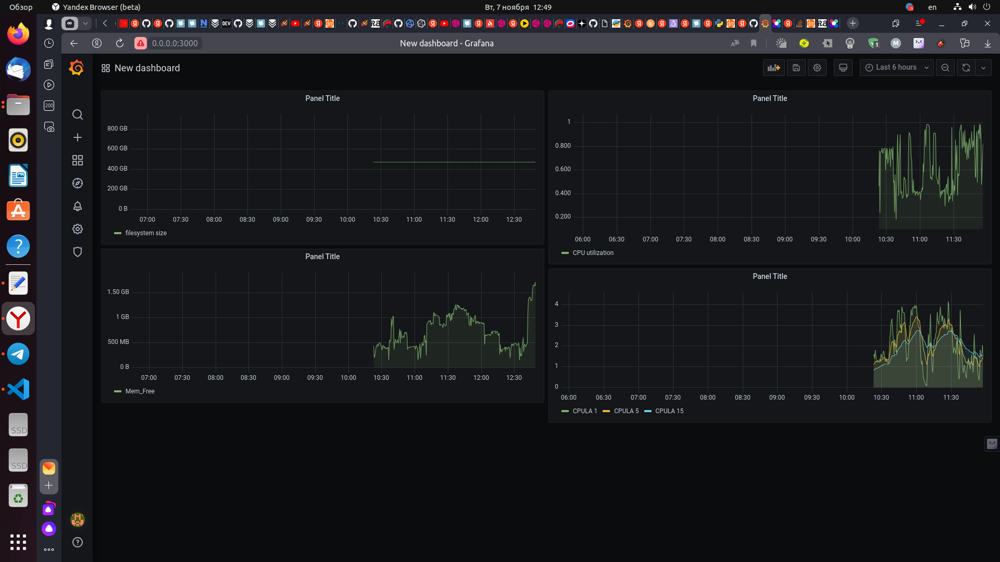
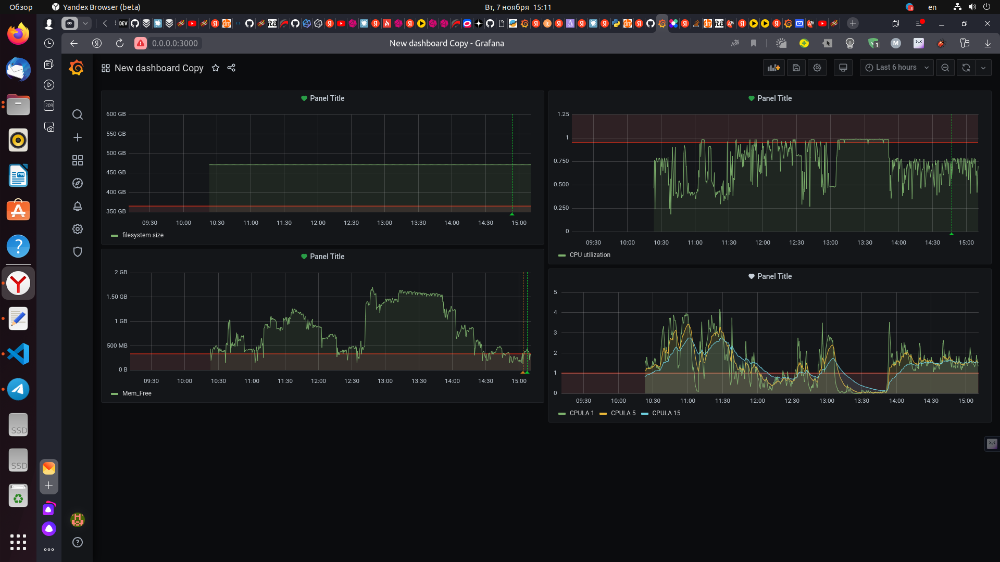

# Домашнее задание к занятию 14 «Средство визуализации Grafana»

## Задание повышенной сложности

**При решении задания 1** не используйте директорию [help](./help) для сборки проекта. Самостоятельно разверните grafana, где в роли источника данных будет выступать prometheus, а сборщиком данных будет node-exporter:

- grafana;
- prometheus-server;
- prometheus node-exporter.

За дополнительными материалами можете обратиться в официальную документацию grafana и prometheus.

В решении к домашнему заданию также приведите все конфигурации, скрипты, манифесты, которые вы 
использовали в процессе решения задания.

**При решении задания 3** вы должны самостоятельно завести удобный для вас канал нотификации, например, Telegram или email, и отправить туда тестовые события.

В решении приведите скриншоты тестовых событий из каналов нотификаций.

## Обязательные задания

### Задание 1

1. Используя директорию [help](./help) внутри этого домашнего задания, запустите связку prometheus-grafana.
1. Зайдите в веб-интерфейс grafana, используя авторизационные данные, указанные в манифесте docker-compose.
1. Подключите поднятый вами prometheus, как источник данных.
1. Решение домашнего задания — скриншот веб-интерфейса grafana со списком подключенных Datasource.


## Решение 1

 - в директории [help](./help) запускаем команду ***docker-compose up -d***
 - смотрим запущенные контейнеры
```
aleksander@aleksander-MS-7641:~/mnt-homeworks/10-monitoring-03-grafana/help$ docker ps
CONTAINER ID   IMAGE                       COMMAND                  CREATED              STATUS          PORTS                                       NAMES
d7c692c61205   grafana/grafana:7.4.0       "/run.sh"                About a minute ago   Up 18 seconds   0.0.0.0:3000->3000/tcp, :::3000->3000/tcp   grafana
0c3c6ea4b799   prom/prometheus:v2.24.1     "/bin/prometheus --c…"   About a minute ago   Up 19 seconds   9090/tcp                                    prometheus
0a71ae2f6703   prom/node-exporter:v1.0.1   "/bin/node_exporter …"   About a minute ago   Up 19 seconds   9100/tcp                                    nodeexporter
```
 - заходим в веб-интерфейс grafana по адресу 0.0.0.0:3000->3000, вводим авторизационные данные, указанные в манифесте docker-compose
<p align="center">
  
</p>
<p align="center">
  
</p>
 - подключаяем поднятый prometheus, как источник данных, прописываем адрес ***http://prometheus:9090***
<p align="center">
  
</p>
<p align="center">
  
</p>
<p align="center">
  
</p>

## Задание 2

Изучите самостоятельно ресурсы:

1. [PromQL tutorial for beginners and humans](https://valyala.medium.com/promql-tutorial-for-beginners-9ab455142085).
1. [Understanding Machine CPU usage](https://www.robustperception.io/understanding-machine-cpu-usage).
1. [Introduction to PromQL, the Prometheus query language](https://grafana.com/blog/2020/02/04/introduction-to-promql-the-prometheus-query-language/).

Создайте Dashboard и в ней создайте Panels:

- утилизация CPU для nodeexporter (в процентах, 100-idle);
- CPULA 1/5/15;
- количество свободной оперативной памяти;
- количество места на файловой системе.

Для решения этого задания приведите promql-запросы для выдачи этих метрик, а также скриншот получившейся Dashboard.

## Решение 2

Создаем Dashboard и в ней создаем Panels:
 - утилизация CPU для nodeexporter (в процентах, 100-idle), запрос для выполнения:
```
avg without (cpu)(irate(node_cpu_seconds_total{job="nodeexporter",mode="idle"}[1m]))
```
<p align="center">
  
</p>
 - CPULA 1/5/15, запрос для выполнения:

```
node_load1{job="nodeexporter"}
node_load5{job="nodeexporter"}
node_load15{job="nodeexporter"}
```
<p align="center">
  
</p>

 - количество свободной оперативной памяти, запрос для выполнения:
```
node_memory_MemFree_bytes{job='nodeexporter'}
```
<p align="center">
  
</p>

 - количество места на файловой системе, запрос для выполнения:
```
node_filesystem_size_bytes{mountpoint="/",fstype!="rootfs"}
```
<p align="center">
  
</p>

 В результате получаем следующий Dashboard:
<p align="center">
  
</p> 

## Задание 3

1. Создайте для каждой Dashboard подходящее правило alert — можно обратиться к первой лекции в блоке «Мониторинг».
1. В качестве решения задания приведите скриншот вашей итоговой Dashboard.

## Решение 3

 - Создаем для каждой Dashboard подходящее правило alert
 - В качестве канала оповещения используем e-mail
<p align="center">
  
</p> 
 - Создаем alert для утилизации CPU
<p align="center">
  
</p>
 - Создаем alert для CPULA 1/5/15
<p align="center">
  
</p>
 - Cоздаем alert для количества свободной оперативной памяти
<p align="center">
  
</p>
 - Cоздаем alert для количества места на файловой системе
<p align="center">
  
</p>

 - скриншоты итоговой Dashboard и созданных alert
<p align="center">
  
</p>
<p align="center">
  
</p>
## Задание 4

1. Сохраните ваш Dashboard.Для этого перейдите в настройки Dashboard, выберите в боковом меню «JSON MODEL». Далее скопируйте отображаемое json-содержимое в отдельный файл и сохраните его.
1. В качестве решения задания приведите листинг этого файла.

## Решение 4

 - Сохраняем созданный Dashboard. Переходим в настройки Dashboard, выбераем в боковом меню «JSON MODEL». Копируем отображаемое json-содержимое в отдельный файл и сохраняем его, содержимое файла домтупно в ссылке.
[json_model.json](https://github.com/anfilippov7/mnt-homeworks/blob/MNT-video/10-monitoring-03-grafana/json_model.json)

---

### Как оформить решение задания

Выполненное домашнее задание пришлите в виде ссылки на .md-файл в вашем репозитории.

---
