# Домашнее задание к занятию 16 «Платформа мониторинга Sentry»

## Задание 1

Так как Self-Hosted Sentry довольно требовательная к ресурсам система, мы будем использовать Free Сloud account.

Free Cloud account имеет ограничения:

- 5 000 errors;
- 10 000 transactions;
- 1 GB attachments.

Для подключения Free Cloud account:

- зайдите на sentry.io;
- нажмите «Try for free»;
- используйте авторизацию через ваш GitHub-аккаунт;
- далее следуйте инструкциям.

В качестве решения задания пришлите скриншот меню Projects.

## Решение 1

1. Заходим на портал sentry.io, авторизуемся через GitHub-аккаунт, создаем новый python-project, результат выполнения:

  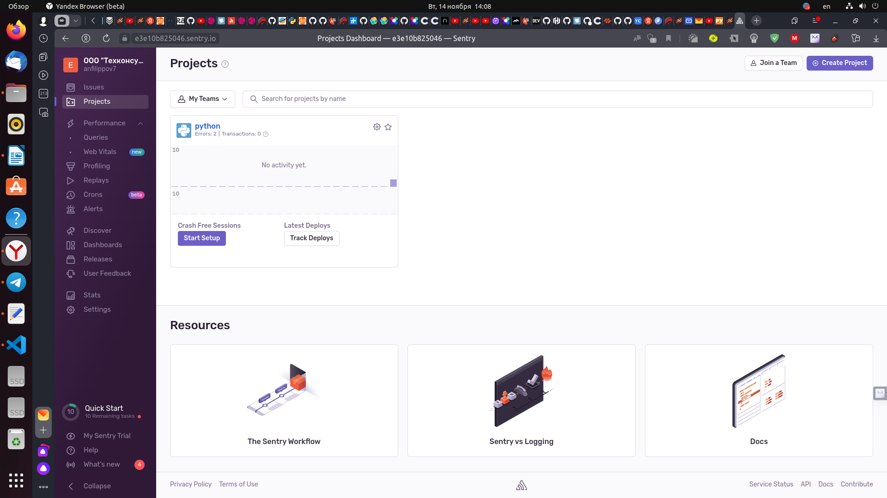

  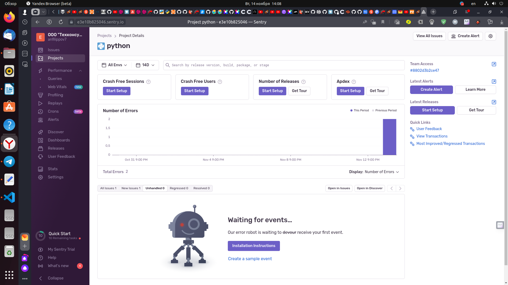

## Задание 2

1. Создайте python-проект и нажмите `Generate sample event` для генерации тестового события.
1. Изучите информацию, представленную в событии.
1. Перейдите в список событий проекта, выберите созданное вами и нажмите `Resolved`.
1. В качестве решения задание предоставьте скриншот `Stack trace` из этого события и список событий проекта после нажатия `Resolved`.

## Решение 2

1. Создаем python-проект и нажмаем `Generate sample event` для генерации тестового события.

  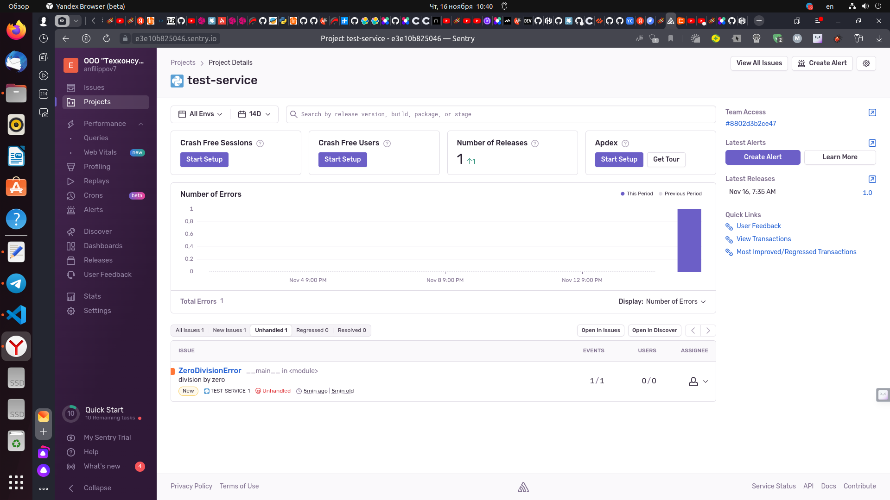

2. В информации, представленной в событии указано наименование ошибки, тэги (окружение, версия языка программирования, имя компьютера и т.д.), а также python код и строка в которой произошла ошибка (номер строки 20) 

  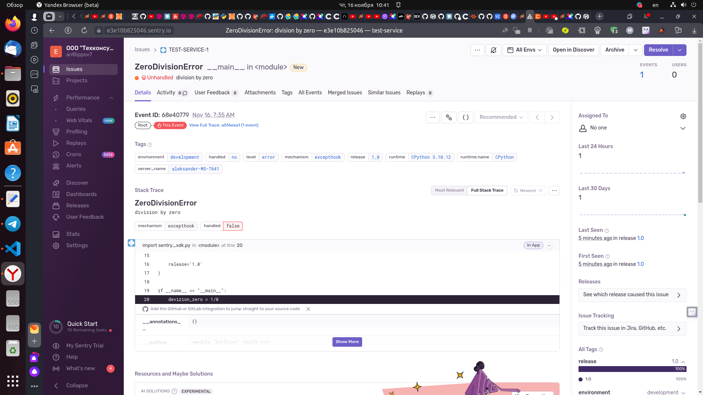

3. Переходим в список событий проекта, выбераем созданное и нажимаем `Resolved`, что переводит сообщение в статус выполненных.
 - в `Stack trace` из этого события указано название файла в котором произошло событие (ошибка), и номер строки в которой произошла ошибка 

  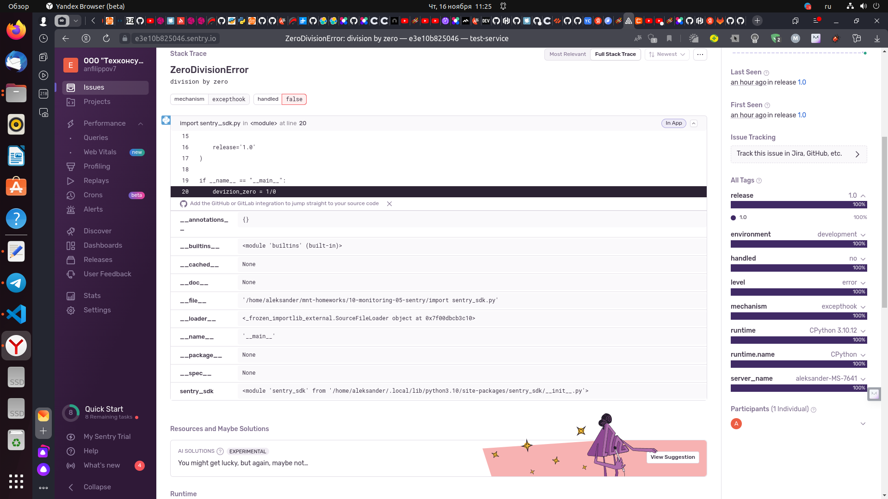

  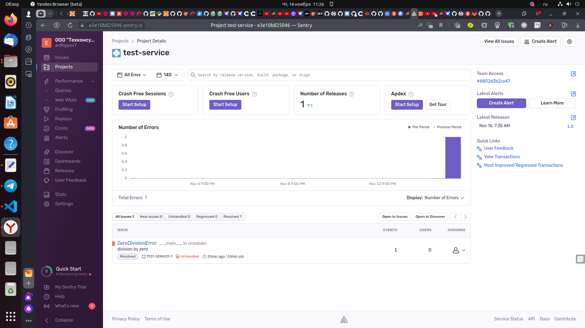

## Задание 3

1. Перейдите в создание правил алёртинга.
2. Выберите проект и создайте дефолтное правило алёртинга без настройки полей.
3. Снова сгенерируйте событие `Generate sample event`.
Если всё было выполнено правильно — через некоторое время вам на почту, привязанную к GitHub-аккаунту, придёт оповещение о произошедшем событии.
4. Если сообщение не пришло — проверьте настройки аккаунта Sentry (например, привязанную почту), что у вас не было 
`sample issue` до того, как вы его сгенерировали, и то, что правило алёртинга выставлено по дефолту (во всех полях all).
Также проверьте проект, в котором вы создаёте событие — возможно алёрт привязан к другому.
5. В качестве решения задания пришлите скриншот тела сообщения из оповещения на почте.
6. Дополнительно поэкспериментируйте с правилами алёртинга. Выбирайте разные условия отправки и создавайте sample events. 

## Решение 3

1. Переходим в создание правил алёртинга.

  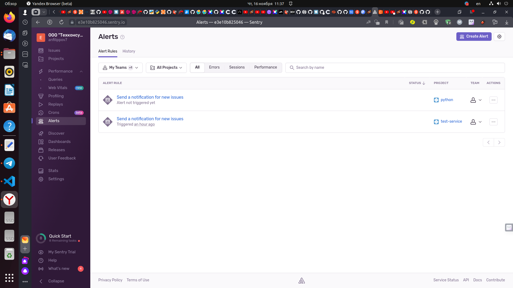

2. Выбираем проект и создаем дефолтное правило алёртинга без настройки полей.

  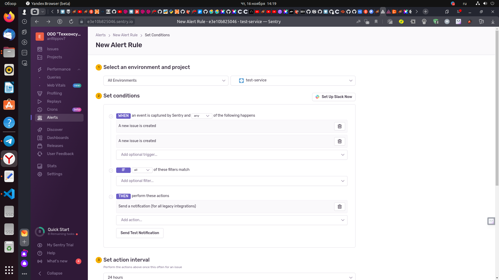

 - добавляем отправку по электронной почте

  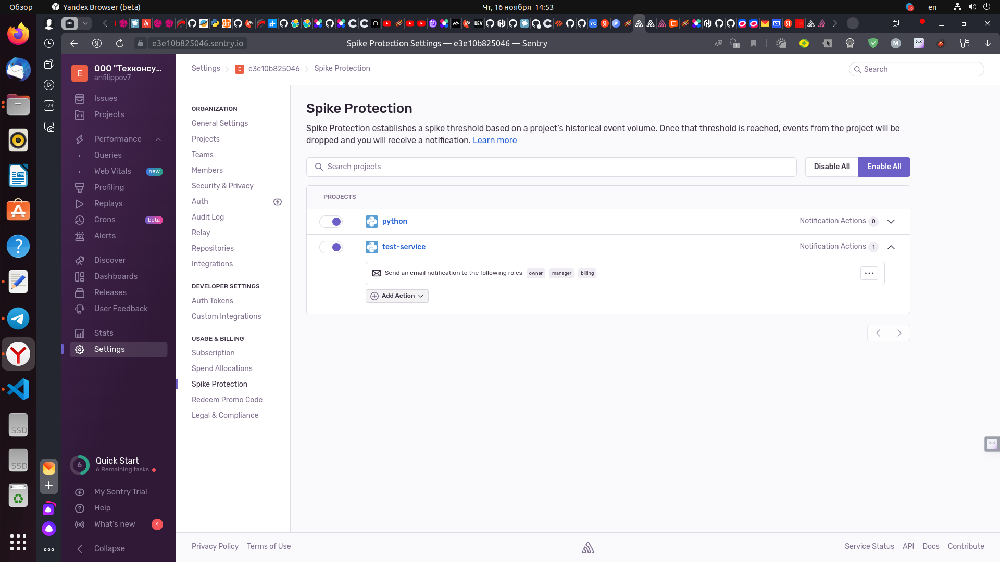

Генерируем событие `Generate sample event`, смотрим результат и проверяем почту

  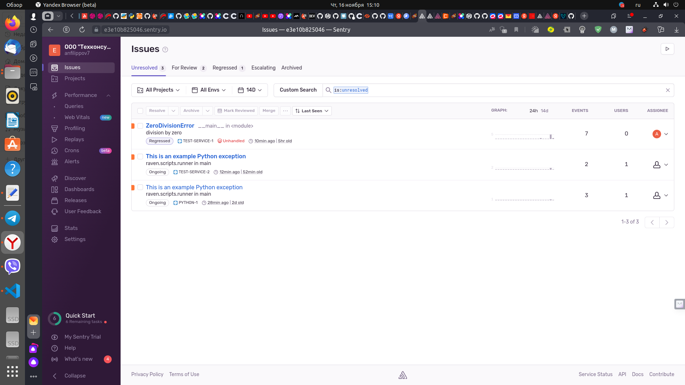

  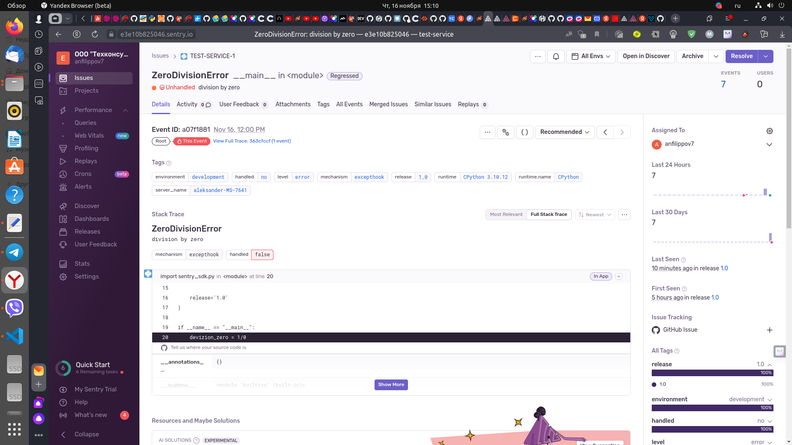

  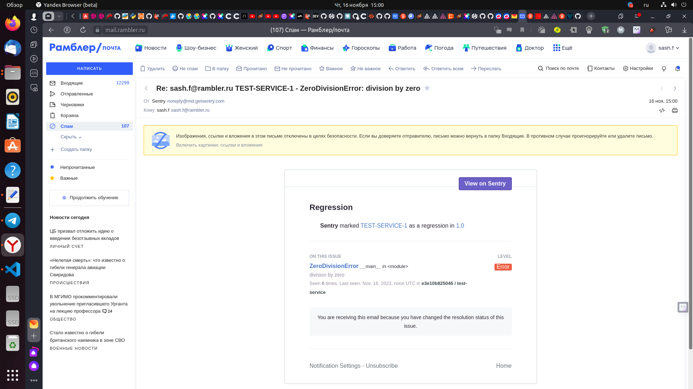

## Задание повышенной сложности

1. Создайте проект на ЯП Python или GO (около 10–20 строк), подключите к нему sentry SDK и отправьте несколько тестовых событий.
2. Поэкспериментируйте с различными передаваемыми параметрами, но помните об ограничениях Free учётной записи Cloud Sentry.
3. В качестве решения задания пришлите скриншот меню issues вашего проекта и пример кода подключения sentry sdk/отсылки событий.

---

### Как оформить решение задания

Выполненное домашнее задание пришлите в виде ссылки на .md-файл в вашем репозитории.

---
